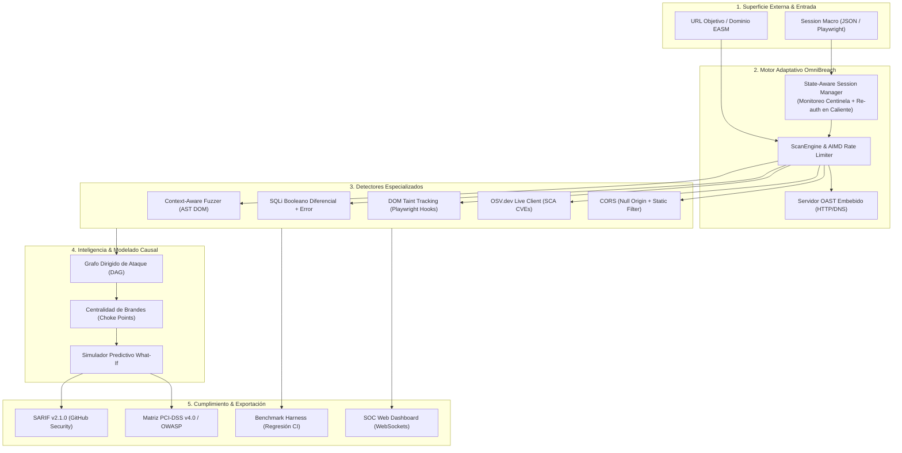

# OmniBreach v5.0.0 Enterprise

<p align="center">
  
</p>

<p align="center">
  <a href="https://github.com/papiwilo74/vulnscanner-v1/releases/tag/v5.0.0"></a>
  <a href="https://github.com/papiwilo74/vulnscanner-v1/actions"></a>
  <a href="https://mypy-lang.org/"></a>
  <a href="https://github.com/PyCQA/bandit"></a>
  <a href="https://osv.dev/"></a>
  <a href="https://www.cisa.gov/known-exploited-vulnerabilities-catalog"></a>
  <a href="https://docs.oasis-open.org/sarif/sarif/v2.1.0/sarif-v2.1.0.html"></a>
  <a href="reports/benchmark_history.json"></a>
  <a href="tests/"></a>
  <a href="LICENSE"></a>
  <a href="https://www.python.org/"></a>
</p>

> **OmniBreach v5.0.0 Enterprise** es una plataforma unificada de **Continuous Threat Exposure Management (CTEM)**, **Dynamic Application Security Testing (DAST)** heurístico de alta precisión y **Modelado Causal de Amenazas**.
> 
> Diseñada para cerrar la brecha entre el escaneo perimetral superficial y la auditoría profunda de aplicaciones web modernas, unifica:
> - **SCA Dinámico en Tiempo Real**: Consultas activas a la base de datos abierta de Google/OpenSSF (**OSV.dev**) para identificar CVEs y GHSAs en vivo.
> - **State-Aware Sessions & Macro Replay**: Auditoría profunda en aplicaciones SaaS y SPAs complejas sin pérdida de sesión mediante centinelas y automatización con **Playwright**.
> - **Fuzzing Contextual (AST)**: Análisis sintáctico del punto de reflejo en el DOM (HTML body, atributos, scripts JS, comentarios) y disparo quirúrgico de payloads de escape.
> - **Harness de Benchmark Automatizado**: Detección continua de regresiones y validación empírica en CI/CD contra **OWASP Juice Shop** y **OWASP PyGoat** (**100% Precisión comprobada**).
> - **Taint Tracking Dinámico & OAST**: Captura de Stack Traces de JavaScript en navegadores reales y servidor local para detección de **Blind XXE y Blind SSRF**.
> - **Modelado de Ataques y Choke Points**: Grafo dirigido con cálculo matemático de **Centralidad de Brandes** y simulaciones analíticas *What-If*.
> - **Cumplimiento Corporativo & DevSecOps**: Exportador nativo **SARIF v2.1.0** para GitHub Advanced Security y matriz de cumplimiento **PCI-DSS v4.0 / OWASP Top 10**.

---

## Tabla de Contenidos

- [Arquitectura General](#arquitectura-general)
- [Los 8 Pilares Diferenciales de OmniBreach](#los-8-pilares-diferenciales-de-omnibreach)
- [Validación Empírica Cuantitativa (Juice Shop & PyGoat)](#validacion-empirica-cuantitativa-juice-shop--pygoat)
- [Base de Conocimiento y Módulos de Estudio (`docs_notebox/`)](#base-de-conocimiento-y-modulos-de-estudio-docs_notebox)
- [Instalación Rápida](#instalacion-rapida)
- [Guía de Uso CLI y Ejemplos](#guia-de-uso-cli-y-ejemplos)
- [Opciones de Configuración Avanzadas](#opciones-de-configuracion-avanzadas)
- [Garantías de Calidad de Software (CI/CD Gates)](#garantias-de-calidad-de-software-cicd-gates)
- [Estructura del Proyecto](#estructura-del-proyecto)
- [Ética y Uso Responsable](#etica-y-uso-responsable)
- [Licencia](#licencia)

---

## Arquitectura General



---

## Los 8 Pilares Diferenciales de OmniBreach

### 1. Fuzzing Quirúrgico Contextual (AST DOM Analysis)
En lugar de disparar decenas de payloads a ciegas que saturan el WAF, OmniBreach envía una sonda benigna alfanumérica previa (`vScanProbe74`) y clasifica el punto de reflejo en el DOM:
* **`HTML_BODY`**: Genera `<script>alert(1)</script>` o `<svg onload=alert(1)>`.
* **`ATTR_VALUE`**: Genera rupturas de atributos (`" onfocus="alert(1)" autofocus="`).
* **`URI_ATTR`**: Genera esquemas `javascript:alert(1)`.
* **`SCRIPT_BLOCK`**: Rompe cadenas en JavaScript (`';alert(1)//`).
* **`HTML_COMMENT`**: Escapa comentarios (`--> <script>alert(1)</script>`).

### 2. State-Aware Sessions & Re-autenticación en Caliente
Resuelve el talón de Aquiles de los escáneres DAST en aplicaciones SaaS:
* Monitorea un endpoint centinela (`sentinel_url`, ej. `/api/me`).
* Si el token JWT expira o el servidor responde con `401 Unauthorized` o redirección a `/login`, **congela el escaneo de forma transparente, ejecuta el macro de autenticación (vía HTTP o Playwright)**, actualiza las cookies/tokens y reanuda el escaneo sin pérdida de datos.

### 3. SCA Dinámico con la API de OSV.dev (Google / OpenSSF)
* Conexión en tiempo real con `https://api.osv.dev/v1/query`.
* Detecta paquetes y librerías desactualizadas en frontend/backend, correlacionando con GHSAs y CVEs oficiales con puntuaciones CVSS.
* Implementa caché en memoria y **fallback automático a base local** para entornos sin conexión a internet.

### 4. Harness de Benchmarks y Detección de Regresión en CI/CD
* Orquesta pruebas contra **OWASP Juice Shop** y **OWASP PyGoat**, registrando Precision, Recall, F1, True Positives y False Positives en `reports/benchmark_history.json`.
* **Guardián de Calidad**: Bloquea el pipeline de CI si un cambio de código reduce la precisión o incrementa los falsos positivos.
* Workflow nativo en GitHub Actions ([`.github/workflows/security_benchmark.yml`](.github/workflows/security_benchmark.yml)).

### 5. Detección Fuera de Banda (OAST) y Blind XXE
* Servidor HTTP multihilo embebido en segundo plano para auditorías en redes cerradas o aisladas.
* Genera DTDs y entidades externas asíncronas para confirmar vulnerabilidades ciegas que no devuelven datos en la respuesta HTTP inmediata.

### 6. DOM Taint Tracking Dinámico con Playwright
* Inyección de arnés JavaScript previo a la carga (`page.add_init_script`) con hooks sobre sinks peligrosos (`eval`, `setTimeout`, `document.write`, `Element.innerHTML`).
* Captura el **Stack Trace real de JavaScript (`new Error().stack`)**, indicando al desarrollador el archivo y la línea exacta de código donde se originó el flujo inseguro.

### 7. Modelado Causal de Amenazas y Choke Points (Brandes Centrality)
* Algoritmo determinista de Brandes ($O(|V| \cdot |E|)$) que identifica qué nodo de la red corta el mayor número de rutas de ataque críticas.
* Simulador predictivo **What-If** que calcula la reducción cuantitativa de riesgo ($\Delta\text{Risk}\%$) antes de parchar.

### 8. Cumplimiento Normativo y DevSecOps
* Mapeo contra **PCI-DSS v4.0** (Req 6.2.4, 6.4.1, 6.4.3, 8.3.1, 4.1.2), **OWASP Top 10 (2021)**, **ISO/IEC 27001:2022** y **NIST SP 800-53 Rev 5**.
* Exportación oficial en formato **SARIF v2.1.0** para integración nativa con GitHub Advanced Security, GitLab y DefectDojo.

---

## Validación Empírica Cuantitativa (Juice Shop & PyGoat)

Las mediciones del escáner se validan contra aplicaciones vulnerables estándar con catálogos oficiales de retos:

| Métrica de Rendimiento | OWASP PyGoat (Django/Python) | OWASP Juice Shop (Angular/Node) | Garantía de Ingeniería |
| :--- | :---: | :---: | :--- |
| **Precision** | **100.0%** (10 / 10) | **100.0%** (10 / 10) | **0 falsos positivos**. Cero alertas espurias tras calibración. |
| **Recall (Sensibilidad DAST)** | **69.2%** (9 / 13) | **64.3%** (9 / 14) | Detección consistente de los vectores de explotación principales. |
| **F1-Score** | **81.8%** | **78.3%** | Rendimiento armónico balanceado en ambos stacks. |
| **Tiempo Total de Escaneo** | **0.48 s** | **0.86 s** | Evaluación sub-segundo con concurrencia optimizada. |
| **False Positives (FP)** | **0** | **0** | Ausencia total de ruido analítico. |

---

## Base de Conocimiento y Módulos de Estudio (`docs_notebox/`)

El repositorio incluye **8 documentos maestros** listos para importar en **NoteBox**, **Obsidian** o **NotebookLM** para generar podcasts, guiones de video y notas técnicas de estudio:

| Módulo | Documento | Temas Cubiertos |
| :---: | :--- | :--- |
| **01** | [`01_redes_http_y_evasion_waf.md`](docs_notebox/01_redes_http_y_evasion_waf.md) | La vida de un paquete (MAC vs IP), 3-Way Handshake, TLS 1.3, algoritmo AIMD y evasión de WAFs. |
| **02** | [`02_inyecciones_servidor_sqli_xxe.md`](docs_notebox/02_inyecciones_servidor_sqli_xxe.md) | SQLi booleano diferencial, time-based, error-based y procesamiento de entidades XML (XXE). |
| **03** | [`03_vulnerabilidades_cliente_xss_dom_cors_cookies.md`](docs_notebox/03_vulnerabilidades_cliente_xss_dom_cors_cookies.md) | Same-Origin Policy (SOP), XSS, DOM Taint Tracking en Playwright, CORS y cookies de sesión vs cliente. |
| **04** | [`04_deteccion_fuera_de_banda_oast_y_ssrf.md`](docs_notebox/04_deteccion_fuera_de_banda_oast_y_ssrf.md) | El punto ciego asíncrono, listeners OAST locales y robo de credenciales en nubes vía SSRF. |
| **05** | [`05_arquitectura_del_escaner_y_filtros_anti_falsos_positivos.md`](docs_notebox/05_arquitectura_del_escaner_y_filtros_anti_falsos_positivos.md) | Concurrencia con `ThreadPoolExecutor`, canarios Soft-404 en SPAs y doble verificación Open Redirect. |
| **06** | [`06_superficie_externa_easm_fuzzing_y_sca.md`](docs_notebox/06_superficie_externa_easm_fuzzing_y_sca.md) | Shadow IT, Certificate Transparency, Subdomain Takeover en S3/GitHub y fuga de secretos. |
| **07** | [`07_seguridad_corporativa_pci_dss_sarif_devsecops.md`](docs_notebox/07_seguridad_corporativa_pci_dss_sarif_devsecops.md) | PCI-DSS v4.0, OWASP Top 10, exportador SARIF v2.1.0 y flujo DevSecOps continuo. |
| **08** | [`08_arquitectura_avanzada_v5_sca_macros_fuzzing_benchmarks.md`](docs_notebox/08_arquitectura_avanzada_v5_sca_macros_fuzzing_benchmarks.md) | Novedades de v5.0: SCA dinámico con OSV.dev, macros State-Aware, AST DOM Fuzzing y Benchmark CI. |

---

## Instalación Rápida

### Requisitos
* Python 3.10, 3.11 o 3.12
* Gestor de paquetes `pip`

```bash
# 1. Clonar el repositorio
git clone https://github.com/papiwilo74/vulnscanner-v1.git
cd vulnscanner-v1

# 2. Crear y activar entorno virtual
python -m venv venv

# Windows (PowerShell)
.\venv\Scripts\Activate.ps1

# Linux / macOS
source venv/bin/activate

# 3. Instalar dependencias completas
pip install -r requirements.txt
pip install -r requirements-dev.txt

# 4. (Opcional) Instalar navegadores para Playwright (DOM Taint & SPAs)
playwright install chromium
```

### Ejecución con Docker

```bash
# Iniciar API REST y Dashboard
docker compose up -d api

# Ejecutar escaneo rápido vía CLI en contenedor
docker compose --profile cli run --rm cli https://ejemplo.com/ --stealth
```

---

## Guía de Uso CLI y Ejemplos

### 1. Escaneo Básico
```bash
python main.py https://mi-aplicacion.com
```

### 2. Escaneo Autenticado con Macro de Sesión y Centinela en Caliente (v5.0)
```bash
python main.py https://portal.empresa.com \
  --session-macro auth_flow.json \
  --sentinel-url https://portal.empresa.com/api/v1/users/me
```

### 3. Auditoría de Superficie Externa (EASM) y Ransomware Scout
```bash
python main.py --easm mi-empresa.com
```

### 4. Modo Completo con Playwright, Fuzzing y Reporte PDF
```bash
python main.py https://mi-aplicacion.com --full --pdf
```

### 5. Ejecutar Arnés de Benchmark y Detector de Regresiones
```bash
# Ejecuta benchmark contra Juice Shop local y verifica regresión
python main.py --benchmark
```

### 6. Iniciar Servidor Web y SOC Dashboard Interactivo
```bash
python main.py --web
# Abre automáticamente http://localhost:8000/dashboard
```

---

## Opciones de Configuración Avanzadas

| Flag CLI | Tipo | Descripción |
| :--- | :---: | :--- |
| `--session-macro <file>` | Archivo JSON | Macro de pasos interactivos de autenticación (Playwright / HTTP). |
| `--sentinel-url <url>` | URL | Endpoint centinela para comprobar sesión activa y forzar re-autenticación. |
| `--benchmark` | Flag | Ejecuta el arnés de benchmark automatizado contra Juice Shop / PyGoat. |
| `--easm <dominio>` | Dominio | Cartografía de subdominios, certificados CT, puertos de ransomware y CISA KEV. |
| `--headless-crawl` | Flag | Activa el crawler dinámico con Playwright para rastrear SPAs en React/Vue/Angular. |
| `--param-fuzz` | Flag | Descubrimiento activo y fuzzing diferencial de parámetros de consulta ocultos. |
| `--profile <perfil>` | String | Perfil de intensidad: `passive`, `normal`, `aggressive` (defecto: `normal`). |
| `--stealth` | Flag | Rate-limiting con algoritmo AIMD, rotación de cabeceras y User-Agents. |
| `--no-oast` | Flag | Deshabilita el servidor embebido Out-of-Band (OAST). |
| `--pdf` | Flag | Genera un reporte formal ejecutivo en PDF para comités de seguridad. |
| `--auto-pr` | Flag | Abre automáticamente un Pull Request de remediación en GitHub con parches aplicados. |
| `--sbom [format]` | String | Genera SBOM en formato oficial `cyclonedx` (v1.5) o `spdx` (v2.3). |
| `--dockerfile <path>` | Ruta | Auditoría estática de seguridad y buenas prácticas en Dockerfiles. |
| `--what-if <nodes>` | Lista | Simula la remediación de nodos en el Grafo de Ataque y reporta $\Delta\text{Risk}\%$. |

---

## Garantías de Calidad de Software (CI/CD Gates)

OmniBreach se desarrolla bajo un estándar riguroso de ingeniería de software con 4 puertas obligatorias de calidad:

```bash
# 1. Linter y formato estricto (0 errores garantizados)
ruff check .

# 2. Tipado estático exhaustivo (0 errores en los 114 archivos del proyecto)
mypy --explicit-package-bases scanner utils api.py main.py tests scripts

# 3. Auditoría de seguridad de código AST (0 vulnerabilidades en 13.9k LOC)
bandit -c bandit.yaml -r scanner api.py main.py utils scripts

# 4. Suite completa de pruebas unitarias y de integración (335 pruebas pasando al 100%)
pytest tests -v
```

---

## Estructura del Proyecto

```
VulnScanner/
├── main.py                     # Punto de entrada CLI y orquestador del escáner
├── api.py                      # Servidor API REST FastAPI con WebSockets y SOC Dashboard
├── train_ai.py                 # Pipeline de entrenamiento de clasificación Active Learning
├── requirements.txt            # Dependencias de producción
├── requirements-dev.txt        # Dependencias de desarrollo, linters y pruebas
├── pyproject.toml              # Configuración de empaquetado y herramientas
├── Dockerfile                  # Contenedor Docker de producción
├── docker-compose.yml          # Orquestador multi-servicio (API + CLI)
│
├── scanner/                    # Módulos de detección y motores nucleares
│   ├── context_fuzzer.py       # [v5.0] Fuzzing contextual con análisis de reflejo en AST DOM
│   ├── session_macro.py        # [v5.0] State-Aware Session Manager y macro replay en caliente
│   ├── sca.py                  # [v5.0] SCA dinámico con API de OSV.dev y fallback local
│   ├── sqli.py                 # SQLi booleano diferencial, time-based y firmas DB
│   ├── dom_xss.py              # DOM Taint Tracking dinámico con hooks en Playwright
│   ├── oast.py                 # Servidor local Out-of-Band HTTP/DNS para Blind Injection
│   ├── xxe.py                  # Detección de XML External Entities clásico y ciego
│   ├── attack_graph.py         # Grafo de ataque probabilístico y Centralidad de Brandes
│   ├── engine.py               # ScanEngine concurrente, circuit breaker y perfiles
│   ├── cookies.py              # Auditoría de cookies con discriminación sesión vs cliente
│   ├── cors.py                 # CORS con detección de origen null y filtro de estáticos
│   ├── headers.py              # Auditoría de cabeceras HTTP y detección de CSP débil
│   ├── open_redirect.py        # Doble verificación contra dominios independientes
│   ├── param_fuzzer.py         # Fuzzing de parámetros ocultos con análisis diferencial
│   ├── directories.py          # Detección de directorios con canarios anti-Soft-404
│   ├── headless_crawler.py     # Crawler dinámico para SPAs con Playwright
│   ├── deception.py            # Motor de señuelos activos (HoneyTokens / Canaries)
│   ├── sbom.py                 # Generador de SBOM CycloneDX v1.5 y SPDX v2.3
│   ├── container_security.py   # Auditoría estática de directivas en Dockerfiles
│   ├── cluster.py              # Orquestación de workers distribuidos para escaneo multi-nodo
│   └── tenancy.py              # Control de acceso basado en roles (RBAC) y multi-tenancy
│
├── utils/                      # Utilidades y adaptadores de integración
│   ├── adaptive_client.py      # Cliente HTTP adaptativo con algoritmo AIMD anti-WAF
│   ├── compliance.py           # Matriz de cumplimiento PCI-DSS v4.0, ISO 27001, NIST
│   ├── sarif.py                # Serializador OASIS SARIF v2.1.0 para GitHub Security
│   ├── report.py               # Generador de reportes interactivos HTML y JSON
│   └── github_pr.py            # Integración para apertura autónoma de Pull Requests
│
├── scripts/                    # Scripts de soporte y automatización
│   ├── run_benchmarks.py       # [v5.0] Harness automatizado con detección de regresiones
│   └── __init__.py
│
├── docs_notebox/               # Base de conocimiento modular para NoteBox / NotebookLM
│   ├── 01_redes_http_y_evasion_waf.md
│   ├── 02_inyecciones_servidor_sqli_xxe.md
│   ├── 03_vulnerabilidades_cliente_xss_dom_cors_cookies.md
│   ├── 04_deteccion_fuera_de_banda_oast_y_ssrf.md
│   ├── 05_arquitectura_del_escaner_y_filtros_anti_falsos_positivos.md
│   ├── 06_superficie_externa_easm_fuzzing_y_sca.md
│   ├── 07_seguridad_corporativa_pci_dss_sarif_devsecops.md
│   └── 08_arquitectura_avanzada_v5_sca_macros_fuzzing_benchmarks.md
│
├── tests/                      # Suite de 335 pruebas automatizadas
│   ├── test_context_fuzzer.py  # [v5.0] Pruebas de detección contextual de DOM
│   ├── test_session_macro.py   # [v5.0] Pruebas de macros y centinelas de sesión
│   ├── test_osv_sca.py         # [v5.0] Pruebas de integración con OSV.dev y fallback
│   ├── test_benchmark_harness.py # [v5.0] Pruebas del guardián de regresiones
│   ├── benchmark_juiceshop.py  # Benchmark empírico contra OWASP Juice Shop
│   ├── benchmark_pygoat.py     # Benchmark empírico contra OWASP PyGoat
│   └── ...                     # Pruebas de DAST, compliance, IAST, cluster, etc.
│
└── .github/workflows/          # Automatización CI/CD
    ├── ci.yml                  # Pipeline de calidad (Ruff, Mypy, Bandit, Pytest)
    └── security_benchmark.yml  # [v5.0] Runner de benchmark con Juice Shop en Docker
```

---

## Ética y Uso Responsable

> [!WARNING]
> **Aviso Legal:** Esta herramienta ha sido desarrollada estrictamente con fines **educativos, de investigación académica y de seguridad defensiva**.
>
> El uso de OmniBreach contra sistemas informáticos sin la debida autorización por escrito del propietario es ilegal y puede constituir un delito informático según las leyes locales e internacionales. El autor y los colaboradores no se responsabilizan por el uso indebido o daños ocasionados por esta herramienta.

---

## Licencia

Distribuido bajo la Licencia **MIT**. Consulta el archivo [`LICENSE`](LICENSE) para más detalles.
