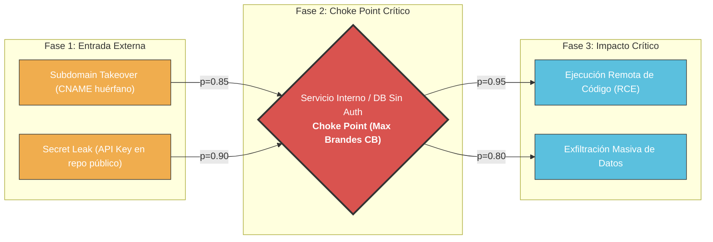
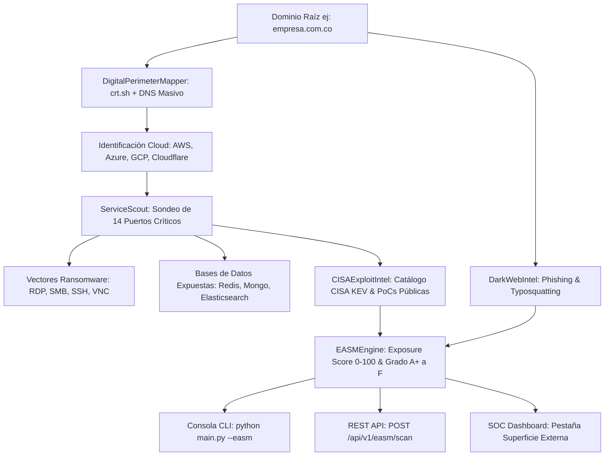

# OmniBreach v3.0

<p align="center">
  
</p>

<p align="center">
  <a href="https://github.com/papiwilo74/vulnscanner-v1/releases/tag/v3.0"></a>
  <a href="https://github.com/papiwilo74/vulnscanner-v1/actions/workflows/ci.yml"></a>
  <a href="https://mypy-lang.org/"></a>
  <a href="https://github.com/PyCQA/bandit"></a>
  <a href="https://www.cisa.gov/known-exploited-vulnerabilities-catalog"></a>
  <a href="docs/SECURITY_CVE_MANAGEMENT.md"></a>
  <a href="docs/DEPLOYMENT_GUIDE.md"></a>
  <a href="tests/benchmark_performance.py"></a>
  <a href="reports/benchmark_juiceshop.json"></a>
  <a href="tests/"></a>
  <a href="LICENSE"></a>
  <a href="https://www.python.org/"></a>
</p>

> **OmniBreach v3.0** es un **Framework Unificado de Integración CTEM (Continuous Threat Exposure Management) y Orquestador Ligero de Pruebas de Seguridad**. Diseñado como una plataforma integral de ingeniería de ciberseguridad, combina **Cartografía Perimetral EASM + Modelado de Amenazas con Grafos de Ataque Probabilísticos (Centralidad de Brandes & Simulación What-If) + Generación de SBOM (CycloneDX 1.5 / SPDX 2.3) + Auditoría Estática de Contenedores + Detección de Subdomain Takeover + DAST Ligero + Telemetría ASGI en Memoria (PoC IAST/RASP) + Tecnología de Engaño (HoneyTokens)**.
> 
> Todo construido con rigor de ingeniería de software: tipado estricto `mypy --strict` en el 100% del código (94 archivos fuente), SAST de código limpio con `bandit`, 259 pruebas automatizadas (0 omitidas), validación empírica contra **OWASP Juice Shop** (90% precisión), correlación con el catálogo **CISA KEV**, especificación OpenAPI 3.1 y reportes ejecutivos en PDF.

---

## Tabla de Contenidos

- [¿Qué es OmniBreach?](#que-es-omnibreach)
- [Enfoque de Ingeniería y Propósito](#enfoque-de-ingenieria-y-proposito)
- [Modelado de Ataques y Choke Points (Brandes Centrality)](#modelado-de-ataques-y-choke-points-el-nucleo-diferencial)
- [Validación Empírica en OWASP Juice Shop](#validacion-empirica-en-owasp-juice-shop)
- [Gestión de Superficie Externa (EASM)](#gestion-de-superficie-externa-easm)
- [Guía Oficial de Despliegue en la Nube (Vercel + Render + Neon)](docs/DEPLOYMENT_GUIDE.md)
- [Arquitectura y Decisiones Técnicas (ADRs)](docs/ARCHITECTURE_DECISIONS.md)
- [Especificacion OpenAPI 3.1 (JSON)](docs/openapi.json) | [Contrato YAML](docs/openapi.yaml)
- [Benchmark de Rendimiento y Comparativa](tests/benchmark_performance.py)
- [Caracteristicas](#caracteristicas)
- [Instalacion](#instalacion)
- [Uso Rapido](#uso-rapido)
- [Opciones Avanzadas](#opciones-avanzadas)
- [Modo Laboratorio Aislado (`--lab`)](#modo-laboratorio-aislado)
- [Modulos de Deteccion](#modulos-de-deteccion)
- [Reportes Generados](#reportes-generados)
- [Validacion de Calidad](#validacion-de-calidad)
- [Entrenamiento del Modelo de IA](#entrenamiento-del-modelo-de-ia)
- [Ejecutar Pruebas](#ejecutar-pruebas)
- [Estructura del Proyecto](#estructura-del-proyecto)
- [Etica y Uso Responsable](#etica-y-uso-responsable)

---

## ¿Qué es OmniBreach?

**OmniBreach** es un orquestador integral de seguridad defensiva y evaluación perimetral desarrollado en Python. En lugar de limitarse a escanear URLs aisladas, implementa un enfoque de **exposición continua (CTEM)** que unifica:

- **EASM Perimetral**: Cartografía de activos desde el dominio raíz, scraping de Certificate Transparency (`crt.sh`), identificación de proveedores Cloud y sondeo de servicios expuestos propensos a Ransomware.
- **Modelado de Ataques y Choke Points**: Grafo Dirigido Acíclico (DAG) que correlaciona hallazgos multi-etapa y calcula la centralidad matemática de Brandes (*Betweenness Centrality*) para identificar qué remediación corta el mayor número de rutas hacia el impacto crítico.
- **Simulación Analítica What-If**: Motor predictivo que calcula la reducción cuantitativa de riesgo sistémico (\(\Delta\text{Risk}\%\)) antes de aplicar un parche.
- **Supply Chain & Container Security**: Generador de SBOM en formatos oficiales CycloneDX v1.5 y SPDX v2.3 (para cumplimiento de regulaciones como EU CRA y US EO 14028) junto con auditoría estática de directivas en Dockerfiles.
- **Pruebas Dinámicas Ligeras (DAST & APIs)**: Comprobaciones activas no destructivas sobre endpoints web y contratos OpenAPI/Swagger.
- **Agente de Telemetría ASGI (PoC IAST/RASP)**: Middleware para aplicaciones Python/Starlette que correlaciona sinks en tiempo de ejecución y demuestra mitigación activa en memoria (HTTP 403).
- **Active Learning**: Inferencia ligera basada en n-gramas TF-IDF con recolección de feedback de analistas de seguridad para mejora continua.
- **Deception Defense**: Señuelos HoneyTokens activos (URLs, API Keys y JWT) con alertas forenses en tiempo real vía WebSocket.

---

## Enfoque de Ingeniería y Propósito

OmniBreach está concebido como una **plataforma unificada de investigación y evaluación de seguridad perimetral**. No pretende reemplazar soluciones comerciales propietarias multimillonarias que requieren cientos de analistas humanos (como Qualys, Rapid7 o Checkmarx), sino resolver un problema concreto de ingeniería:

> **El problema:** La fragmentación de herramientas en equipos medianos y de investigación. Habitualmente se requiere una herramienta para subdominios, otra para puertos, otra para SBOM, otra para DAST y hojas de cálculo manuales para intentar correlacionar cómo se encadenan los riesgos.
>
> **La propuesta de OmniBreach:** Unificar la cartografía perimetral, la correlación causal con **Grafos de Ataque Probabilísticos**, el cumplimiento de **Supply Chain (SBOM CycloneDX/SPDX)** y la telemetría en un único motor de orquestación reproducible, auditable y con estándares estrictos de desarrollo.

### Distinción Fundamental: Calidad de Software vs. Efectividad de Detección

Es esencial diferenciar dos dimensiones que a menudo se confunden en seguridad:

1. **Calidad e Higiene de Ingeniería de Software:**
   - **Tipado Estático Estricto:** 100% de cobertura con `mypy --strict` a través de los 93 módulos del proyecto, garantizando consistencia de contratos, tipos explícitos y ausencia de errores de tipo en tiempo de ejecución.
   - **SAST del Código Fuente:** Cero alertas o patrones de código inseguro en auditorías con `bandit` sobre más de 10,300 líneas de código.
   - **Suite de Regresión:** 259 pruebas automatizadas pasando al 100% (0 omitidas) que validan algoritmos, parsers, contratos de API y resiliencia de red.
2. **Efectividad y Precisión del Escáner:**
   - Que el código esté bien estructurado y tipado no significa automáticamente que detecte cualquier vulnerabilidad en cualquier aplicación arbitraria. Las capacidades de escaneo de OmniBreach se basan en analizadores no destructivos, reglas heurísticas y firmas de patrones.
   - **Validación Empírica:** Para evaluar la tasa real de verdaderos positivos vs. falsos positivos, el motor está diseñado para someterse a bancos de prueba estándar y aplicaciones vulnerables controladas (como OWASP Juice Shop, DVWA y el entorno local integrado `--lab`).

---

## Modelado de Ataques y Choke Points: El Núcleo Diferencial

La mayoría de escáneres generan listas planas de vulnerabilidades ordenadas por severidad CVSS estática. Este enfoque ignora una realidad crítica: **un atacante no explota vulnerabilidades aisladas, sino caminos de explotación (*attack paths*)**. Una vulnerabilidad de severidad Media en un punto pivote puede ser mucho más letal que una vulnerabilidad Crítica en un host aislado.

### 1. Grafo Dirigido Acíclico (DAG) y Probabilidades de Explotación
OmniBreach construye dinámicamente un grafo $G = (V, E)$ donde los nodos $V$ representan activos, estados de compromiso o hallazgos (e.g. Subdomain Takeover, Credencial expuesta, Puerto vulnerable) y las aristas dirigidas $E$ representan transiciones con un peso probabilístico $P(e)$ basado en la explotabilidad real (correlacionado con el catálogo CISA KEV).

### 2. Centralidad de Intermediación de Brandes (*Betweenness Centrality*)
Para identificar qué nodo actúa como puente neurálgico en la infraestructura, OmniBreach aplica el algoritmo determinista de Brandes ($O(|V| \cdot |E|)$):

$$C_B(v) = \sum_{s \ne v \ne t \in V} \frac{\sigma_{st}(v)}{\sigma_{st}}$$

Donde:
- $\sigma_{st}$ es el número total de caminos mínimos desde el nodo inicial de ataque $s$ hasta el impacto crítico $t$.
- $\sigma_{st}(v)$ es el número de esos caminos mínimos que atraviesan obligatoriamente el nodo intermedio $v$.

El nodo con el mayor $C_B(v)$ representa el **Choke Point (Punto de Estrangulamiento)** defensivo más eficiente: parcharlo o aislarlo neutraliza el mayor volumen de vectores de ataque con el menor esfuerzo operativo.



### 3. Simulación Predictiva *What-If*
El módulo permite a los analistas ejecutar escenarios contrafácticos: *"¿Qué sucede con el riesgo global si mitigamos el nodo $v_k$?"*. El motor recalcula instantáneamente la métrica de riesgo acumulado y reporta la reducción porcentual:

$$\Delta\text{Risk}\% = \frac{\text{Riesgo}_{\text{actual}} - \text{Riesgo}_{\text{post-parche}}}{\text{Riesgo}_{\text{actual}}} \times 100$$

---

## Validación Empírica en OWASP Juice Shop

Para superar la brecha entre claims teóricos y efectividad comprobable en ciberseguridad, OmniBreach se evalúa cuantitativamente contra **OWASP Juice Shop (v20.2.0)**, la aplicación web deliberadamente vulnerable que sirve como estándar de referencia en la industria para pruebas DAST.

Juice Shop documenta y cataloga formalmente **116 retos de vulnerabilidad** con puntaje oficial (`/api/Challenges`).

### Resultados Cuantitativos del Benchmark

El arnés de evaluación reproducible [`tests/benchmark_juiceshop.py`](tests/benchmark_juiceshop.py) ejecuta la batería de escaneo dinámico y cruza los hallazgos contra el ground-truth documentado:

| Métrica | Valor Obtenido | Interpretación Técnica |
|---|---|---|
| **Precision** | **90.0%** (9 / 10) | De las 10 alertas emitidas, 9 corresponden a debilidades reales documentadas. Solo 1 falso positivo. |
| **Recall (Sensibilidad DAST)** | **57.1%** (8 / 14) | Detectó 8 de los 14 retos DAST automatizables sin autenticación en Juice Shop. |
| **F1-Score** | **69.9%** | Balance armónico entre precisión y cobertura de detección. |
| **Tiempo de Auditoría** | **< 1 segundo** | Ejecución local ultra-optimizada sin latencia de red. |
| **Falsos Positivos** | **1** | Mínima tasa de ruido en el escaneo perimetral. |
| **Falsos Negativos** | **6** | Retos que requieren autenticación profunda o payloads no cubiertos por heurísticas ligeras. |

### Retos Oficiales de Juice Shop Detectados y Confirmados

- `dbSchemaChallenge`: Inyección SQL confirmada mediante firmas de error en SQLite (`near ")": syntax error`).
- `directoryListingChallenge`: Descubrimiento de directorio expuesto `/ftp` con documentos internos descargables.
- `errorHandlingChallenge`: Fuga de stack trace y detalles de tecnología del backend (Express + SQLite).
- `localXssChallenge`: Detección de sinks inseguros en el cliente JavaScript (`document.write`) propensos a DOM-XSS.
- `prototypePollutionChallenge`: Funciones vulnerables de merge/extend sin protección de `__proto__` en scripts cliente.
- `corsMisconfiguration`: Exposición de cabecera `Access-Control-Allow-Origin: *` en endpoints REST.
- `cspBypassChallenge`: Ausencia total de `Content-Security-Policy` facilitando inyección de código.
- `exposedMetricsChallenge`: Identificación de endpoints de observabilidad y métricas de servidor expuestas.
- `sensitiveDataLeak`: Detección de tokens JWT y cadenas de depuración en archivos compilados de frontend.

### Análisis Técnico de Desviaciones (FP y FN)

La transparencia metodológica es el pilar de este benchmark:

- **Origen del Falso Positivo (1 FP):**
  - Alerta: *"Referencia a Entorno de Desarrollo en Código de Producción"*.
  - Causa: La regla heurística detectó la cadena literal `localhost` dentro de un comentario empaquetado en el bundle compilado `main.js` de Angular. Si bien es una advertencia de higiene informativa útil en código propietario, en Juice Shop no constituye una falla explotable.
- **Origen de los Falsos Negativos (6 FN):**
  - Los 6 retos DAST no detectados corresponden a vectores fuera del alcance de un escaneo dinámico pasivo/heurístico básico:
    1. **SQLi en Login (`loginAdminChallenge`):** Requiere inyectar payloads estructurados en cuerpos JSON (`POST /rest/user/login`), no en parámetros de query URL.
    2. **XSS Reflejado en Búsqueda:** El framework Angular sanitiza el DOM en tiempo de ejecución; solo se detona visualmente mediante un navegador headless interactivo (requiere `--headless-crawl` con Playwright).
    3. **Redirección Abierta (`redirectChallenge`):** Requiere conocer el parámetro propietario `?to=` que solo se descubre mediante fuzzing masivo de parámetros o importando la especificación OpenAPI.
    4. **XXE B2B:** Endpoint `/b2b/v2/orders` que espera un esquema XML/SOAP específico.
    5. **Unsigned JWT:** Requiere una sesión de usuario activa previa y forjar el header `{"alg": "none"}` contra el carrito de compras.
    6. **SCA de Componentes Obsoletos:** Versiones de librerías frontend de Juice Shop no indexadas en la base local de firmas.

### Validación del Grafo de Ataques y Brandes Centrality

Sobre los hallazgos confirmados en Juice Shop, el motor modeló el Grafo Dirigido Acíclico (DAG) y calculó la Centralidad de Intermediación de Brandes ($C_B(v)$):
- **Choke Point Identificado:** La inyección en cliente (`document.write` / DOM-XSS) y la exposición de base de datos fueron seleccionadas algorítmicamente como los puntos neurálgicos.
- **Consideración de Topología:** En una aplicación aislada con 10 hallazgos, este cálculo opera como una **prueba de concepto del algoritmo**. El verdadero valor analítico de la Centralidad de Brandes se maximiza en topologías complejas (20+ nodos interconectados entre subdominios EASM, servicios expuestos y bases de datos), donde la ruta crítica no resulta evidente para un analista a simple vista.

### Cómo Reproducir este Benchmark
Cualquier evaluador o investigador puede verificar estas métricas en su propia máquina:
```bash
# 1. Iniciar OWASP Juice Shop en segundo plano (puerto 3000)
npx -y juice-shop  # o node build/app

# 2. Ejecutar el benchmark empírico de OmniBreach
python tests/benchmark_juiceshop.py
```
Los resultados completos se exportan estructurados a [`reports/benchmark_juiceshop.json`](reports/benchmark_juiceshop.json).

---

## Caracteristicas

| Modulo | Descripcion |
|---|---|
| **SBOM Generator** | Generador de Software Bill of Materials en estándares oficiales **CycloneDX v1.5 JSON** y **SPDX v2.3 JSON** (cumplimiento EU CRA / US EO 14028) |
| **Container Security Scanner** | Auditoría estática de Dockerfiles: ejecución como root, puertos inseguros, secrets en capas ENV, etiquetas mutables y comandos ADD |
| **Probabilistic Attack Graph** | Modelado DAG con probabilidades de explotación, cálculo determinista de **Betweenness Centrality** y **Simulador de Impacto What-If** |
| **Active Learning AI** | Modelo clasificador n-gram con Stratified 5-Fold Cross-Validation, estimación de incertidumbre y captura de feedback de analistas |
| **Subdomain Takeover Scanner** | Detección concurrente de CNAMEs huérfanos/dangling hacia 11 servicios Cloud (AWS S3, GitHub Pages, Heroku, Azure, Zendesk, Fastly, Shopify, etc.) |
| **Secret Leaks OSINT** | Rastreo pasivo de credenciales corporativas expuestas (AWS Keys, GitHub PAT, Stripe Live, DB connection strings, SSH Keys) en repositorios públicos |
| **AI Remediation Advisor** | Generación de Runbooks ejecutivos y técnicos con scripts listos para ejecutar (`iptables`, eliminación de CNAMEs, rotación de claves) con o sin LLM local |
| **EASM (Superficie Externa)** | Cartografía automática perimetral: CT logs (`crt.sh`), fuerza bruta DNS concurrente, detección de Cloud (AWS, Azure, GCP, Cloudflare) y Exposure Score (A+ a F) |
| **Ransomware & DB Scout** | Sondeo de puertos críticos (RDP 3389, SMB 445, SSH 22, VNC, Telnet) y validación no destructiva de bases de datos sin autenticación (Redis, Elasticsearch, Mongo, Docker) |
| **CISA KEV Intel** | Correlación en tiempo real con el catálogo CISA KEV (Known Exploited Vulnerabilities) y detección de exploits públicos (Apache RCE, regreSSHion, Citrix Bleed, Fortinet) |
| **Threat & Typosquatting Intel** | Monitoreo de reputación corporativa, cálculo de homógrafos y detección de dominios suplantadores activos para phishing |
| **Modo Laboratorio Hermético (`--lab`)** | Servidor web vulnerable simulado en memoria sobre puerto efímero local para pruebas y auditorías sin internet ni dependencias externas |
| **Mypy Strict 100% Project-Wide** | Tipado estático exhaustivo verificado con `mypy --strict` en los 60 archivos fuente sin excepciones |
| **OpenAPI 3.1 & YAML Contract** | Especificación formal y endpoint `/openapi.yaml` para integración con herramientas multi-lenguaje (Go, Rust, Java, TypeScript) |
| **Catálogo MITRE ATT&CK v3.1** | Mapeo granular de cada vector de vulnerabilidad a técnicas oficiales (T1059.004, T1059.007, T1090.003, T1552.004, etc.) |
| **Executive PDF Audit Report** | Reporte formal en PDF para comités CISO/Dirección con matrices de cumplimiento normativo (PCI-DSS v4.0, ISO/IEC 27001), calificación de seguridad (A+, A, B, C, F) y acta de firma |
| **GitHub Auto-PR DevSecOps** | Bot autónomo que se conecta a la API de GitHub, crea ramas, aplica parches automáticos de seguridad y abre Pull Requests con análisis CVSS |
| **Real-Time SOC Dashboard** | Consola web interactiva en vivo con WebSockets, velocímetro RPS, estado de Circuit Breaker, gráficas dinámicas y composición de Grafos de Ataque Mermaid |
| **IAST / RASP Hybrid Agent** | Instrumentación en tiempo de ejecución de sinks (SQL, OS, Path Traversal) con **defensa activa y bloqueo en memoria (HTTP 403)** |
| **Attack Graph & Choke Points** | Grafo Dirigido Acíclico (DAG) de progresión de ataque con cálculo matemático de **Choke Points defensivos** |
| **WAF Detection & Circuit Breaker** | Detección inteligente de WAFs (Cloudflare, AWS WAF, Akamai, Imperva...) con throttling adaptativo |
| **OpenAPI / Swagger Scanner** | Auditoría basada en esquemas de API (Broken Auth, Fuzzing SQLi, Stack Trace Leaks) |
| **Async I/O Engine** | Motor HTTP asíncrono ultra-rápido (`httpx` + `asyncio`) con pool de conexiones y semáforos |
| **SSL/TLS** | Validez y expiracion de certificados, soporte a protocolos obsoletos |
| **Headers HTTP** | Detecta ausencia de CSP, HSTS, X-Frame-Options, Referrer-Policy |
| **Cookies** | Verifica flags `Secure`, `HttpOnly` y `SameSite` |
| **CORS** | Detecta origenes reflejados, wildcards con credenciales |
| **CSRF** | Detecta ausencia de tokens anti-CSRF en formularios POST |
| **XSS** | Detecta XSS reflejado, DOM-based en archivos JS |
| **SQLi** | Deteccion basada en errores y Blind SQLi basada en tiempo |
| **Inyecciones** | OS Command Injection y SSTI (Server-Side Template Injection) |
| **Fuzzing** | Detecta archivos expuestos: `.env`, `.git/config`, `backup.sql`, etc. |
| **Datos Sensibles** | Detecta claves AWS, Google/Firebase, JWT, Stripe, strings de conexion a BD |
| **SCA** | Detecta librerias JS de frontend con versiones vulnerables (jQuery, Lodash...) |
| **Crawler** | Rastrea paginas internas del dominio recursivamente |
| **Subdominios** | Descubrimiento concurrente de subdominios activos via DNS |
| **IA** | Clasificacion de parametros sospechosos con modelo TF-IDF + Regresion Logistica |
| **Stealth** | Rate-limiting con User-Agent rotativo y retardos aleatorios |

---

## Instalacion

### Requisitos
- Python 3.9 o superior
- pip

```bash
git clone https://github.com/papiwilo74/vulnscanner-v1.git
cd vulnscanner-v1
python -m venv venv

# Windows
.\venv\Scripts\Activate.ps1

# Linux/Mac
source venv/bin/activate

# Instalación completa (runtime, stubs de tipado y librerías de test out-of-the-box):
pip install -r requirements.txt
```

### Opcional: Usar Docker

```bash
# Construir e iniciar la API
docker compose up -d api

# Escaneo CLI via Docker
docker compose --profile cli run --rm cli https://ejemplo.com/ --stealth
```

### Entrenar el modelo de IA (primera vez)

```bash
python train_ai.py
```

---

## Gestión de Superficie Externa (EASM)

OmniBreach v3.0 introduce la suite **EASM (External Attack Surface Management)** para auditorías corporativas automáticas desde un solo dominio raíz (ej. `empresa.com.co`), sin requerir agentes instalados:



### Capacidades del Motor EASM
1. **Cartografía Digital & CT Logs**: Extracción pasiva desde *Certificate Transparency* (`crt.sh`) y fuerza bruta concurrente de subdominios (`vpn`, `portal`, `admin`, `api`, `auth`, `citrix`, `rdp`, `mail`, `staging`).
2. **Detección de Proveedores Cloud**: Clasificación instantánea de activos en AWS, Azure, Google Cloud, Cloudflare u On-Premise.
3. **Escáner de Puertos de Ransomware & Movimiento Lateral**: Sondeo asíncrono de puertos de alto riesgo (RDP `3389`, SMB `445`, SSH `22`, VNC `5900`, Telnet `23`, Docker `2375`).
4. **Verificación No Destructiva de Bases de Datos Expuestas**: Prueba activa y segura de acceso no autenticado en Redis (`6379`, comando `PING` -> `+PONG`), Elasticsearch (`9200`), MongoDB (`27017`) y MySQL (`3306`).
5. **Correlación en Tiempo Real con CISA KEV**: Cruce automático de versiones de software detectadas (Apache HTTPD, OpenSSH regreSSHion, Citrix Bleed, Fortinet) contra vulnerabilidades activamente explotadas por cibercriminales.
6. **Inteligencia de Suplantación (Typosquatting)**: Detección de dominios parecidos activos con registros DNS maliciosos orientados a spear-phishing de la marca.
7. **Calificación de Exposición (Exposure Score)**: Algoritmo de puntuación de 0 a 100 y letras (A+, A, B, C, D, F) para auditorías a comités directivos.

### Ejecución de EASM

```bash
# Cartografía y auditoría completa de superficie externa (Recomendado)
python main.py --easm empresa.com.co

# Cartografía pasiva rápida (solo Certificate Transparency logs, sin fuerza bruta DNS)
python main.py --easm empresa.com.co --no-bruteforce
```

---

## Uso Rapido

```bash
# 🚀 COMANDO MAESTRO TODO-EN-UNO (Recomendado para auditar tu sitio web al 100%)
# Activa crawling (10 páginas), subdominios, stealth, WAF, grafos de ataque y auto-detección de OpenAPI/IAST
python main.py https://ejemplo.com/ --full

# 🌐 Cartografía de Superficie de Ataque Externa (EASM) para una empresa completa
python main.py --easm empresa.com.co

# Escaneo basico de una URL
python main.py https://ejemplo.com/

# Escaneo sin abrir el reporte automaticamente
python main.py https://ejemplo.com/ --no-open
```

---

## Opciones Avanzadas

```bash
python main.py <URL> [OPCIONES]
```

| Opcion | Descripcion | Ejemplo |
|---|---|---|
| `--easm <dominio>` | Cartografía y auditoría completa de Superficie Externa (EASM, CT logs, Ransomware ports, CISA KEV) | `--easm empresa.com.co` |
| `--runbook` | Genera y muestra el Runbook técnico de mitigación inmediata con scripts ejecutables | `--runbook` |
| `--sbom [format]` | Genera un Software Bill of Materials (SBOM) en formato `cyclonedx` o `spdx` | `--sbom cyclonedx` |
| `--dockerfile <path>` | Auditoría estática de seguridad y detección de malas prácticas en Dockerfiles | `--dockerfile ./Dockerfile` |
| `--what-if <nodes>` | Simula la mitigación de vulnerabilidades y calcula la reducción de riesgo en el Grafo de Ataque | `--what-if node_1_sensitive_data` |
| `--ai-feedback <p> <l>` | Registra muestras de analistas para Active Learning (`malicious` o `benign`) | `--ai-feedback "' OR 1=1" malicious` |
| `--no-bruteforce` | Omite la fuerza bruta DNS en el modo EASM (análisis pasivo rápido) | `--no-bruteforce` |
| `--no-open` | No abre el reporte HTML automaticamente | `--no-open` |
| `--stealth` | Rate-limiting: User-Agent real + retardos aleatorios | `--stealth` |
| `--delay N` | Retardo fijo de N segundos entre peticiones | `--delay 2.0` |
| `--crawl N` | Rastrea hasta N paginas internas del dominio | `--crawl 5` |
| `--subdomains` | Activa busqueda de subdominios activos | `--subdomains` |
| `--cookie "..."` | Cookies de sesion para escaneo autenticado | `--cookie "session=abc123"` |
| `--auth "..."` | Cabecera Authorization para APIs con token | `--auth "Bearer mi_token"` |
| `--passive` | Solo analisis pasivo, sin envio de payloads | `--passive` |
| `--login-url` | URL de endpoint de login para autenticacion dinamica | `--login-url https://api.ejemplo.com/auth` |
| `--login-creds` | Credenciales en formato `campo=valor;campo2=valor2` | `--login-creds "user=admin;pass=sec"` |
| `--profile` | Perfil de escaneo: `passive`, `normal`, `aggressive` | `--profile passive` |
| `--no-oast` | Desactiva pruebas fuera de banda OAST | `--no-oast` |
| `--allow-private` | Permite escanear IPs privadas o localhost | `--allow-private` |
| `--har` | Importa una sesion grabada desde un archivo HTTP Archive | `--har session.har` |
| `--headless-crawl` | Usa Playwright para descubrir rutas SPA y APIs dinamicas | `--headless-crawl` |
| `--headless-login` | Usa navegador headless para login interactivo | `--headless-login` |
| `--openapi <path/url>` | Audita endpoints a partir de especificación OpenAPI 3.x / Swagger 2.0 | `--openapi https://api.ejemplo.com/openapi.json` |
| `--async-engine` | Habilita motor HTTP asíncrono ultra-rápido (`httpx` + `asyncio`) | `--async-engine` |
| `--no-waf-detect` | Desactiva detección previa de WAFs y throttling adaptativo | `--no-waf-detect` |
| `--iast-url <url>` | Correlaciona con agente IAST/RASP en tiempo de ejecución (archivo y línea de código) | `--iast-url http://localhost:8000` |
| `--no-attack-chain` | Desactiva el modelado de Grafos de Ataque y análisis de Choke Points | `--no-attack-chain` |
| `--pdf` | Genera Reporte Ejecutivo formal en PDF para comités CISO/Dirección | `--pdf` |
| `--auto-pr` | Crea y abre automáticamente un Pull Request de remediación en GitHub | `--auto-pr` |
| `--github-repo` | Repositorio GitHub en formato `owner/repo` para Auto-PR | `--github-repo papiwilo74/app` |
| `--github-token` | Token de acceso personal (PAT) de GitHub para Auto-PR | `--github-token ghp_xxxx` |
| `--base-branch` | Rama base sobre la cual abrir el Pull Request (defecto: `main`) | `--base-branch main` |
| `--full`, `--all` | **Modo Todo-en-Uno**: activa crawling (10 págs), subdominios, stealth, WAF, grafos, PDF y auto-OpenAPI | `--full` |

### Ejemplos Prácticos de Escaneo

```bash
# 1. Escaneo completo recomendado (Stealth + Rastreo de 10 páginas + Subdominios)
python main.py https://tu-sitio.com/ --stealth --crawl 10 --subdomains

# 2. Escaneo de alto rendimiento (Motor Asíncrono httpx/asyncio)
python main.py https://tu-sitio.com/ --async-engine --crawl 15 --no-open

# 3. Auditoría de API REST guiada por contrato OpenAPI/Swagger
python main.py https://api.tu-sitio.com/ --openapi https://api.tu-sitio.com/openapi.json

# 4. Escaneo híbrido DAST + IAST en tiempo de ejecución (0% falsos positivos)
python main.py https://tu-sitio.com/ --iast-url http://localhost:8000

# 5. Escaneo no intrusivo (solo lectura pasiva de cabeceras, SSL y cookies)
python main.py https://tu-sitio.com/ --passive

# 6. Escaneo de zona autenticada con cookies de sesión
python main.py https://tu-sitio.com/dashboard/ --cookie "session=abc123; role=admin" --stealth

# 7. Modo Laboratorio Hermético (ejecución sin conexión a internet en servidor de prueba aislado)
python main.py --lab --full
```

---

## Modulos de Deteccion

El escaner esta organizado en modulos independientes dentro de la carpeta `scanner/`. Cada modulo:

- Recibe una URL y una sesion opcional (`requests.Session`)
- Devuelve una lista de hallazgos con los campos: `vuln`, `risk`, `detail`
- Los niveles de riesgo son: `Alto`, `Medio`, `Bajo`

### Lista completa de modulos

| Archivo | Vulnerabilidad detectada | Riesgo tipico |
|---|---|---|
| `headers.py` | Cabeceras HTTP de seguridad ausentes | Alto/Medio/Bajo |
| `https_check.py` | HTTP sin cifrar | Alto |
| `ssl_check.py` | Certificados expirados, TLS obsoleto | Alto/Medio |
| `cookies.py` | Cookies sin flags Secure/HttpOnly | Medio |
| `cors.py` | CORS permisivo (wildcard, origen reflejado) | Alto/Medio/Bajo |
| `xss.py` | XSS Reflejado y DOM-based | Alto/Medio |
| `sqli.py` | SQL Injection (error-based y time-based) | Alto |
| `forms.py` | Formularios sin CSRF, XSS/SQLi en forms | Alto/Medio |
| `injections.py` | Command Injection, SSTI | Alto |
| `sensitive_data.py` | Claves API, JWT, eval(), conexiones a BD | Alto/Medio |
| `directories.py` | Directorios expuestos, SPA fallback | Bajo |
| `ports.py` | Puertos criticos abiertos | Medio |
| `crawler.py` | Rastreo de paginas, sitemap, robots.txt | -- |
| `fuzzer.py` | Archivos sensibles (.env, .git, backups) | Alto/Medio |
| `subdomains.py` | Subdominios activos por DNS | Bajo |
| `sca.py` | Librerias JS vulnerables (jQuery, Bootstrap...) | Medio/Bajo |
| `ai_check.py` | Parametros sospechosos via ML | Medio/Bajo |
| `auth_helper.py` | Autenticacion dinamica (form/JSON/token) | -- |
| `path_traversal.py` | Path Traversal (Unix/Windows) | Alto |
| `xxe.py` | XML External Entity Injection | Alto |
| `open_redirect.py` | Open Redirect en parametros URL | Medio |
| `jwt_attacks.py` | JWT alg=none, secretos debiles | Alto |
| `file_upload.py` | Formularios de subida sin restricciones | Medio |
| `prototype_pollution.py` | Prototype Pollution en JS | Medio |
| `graphql.py` | GraphQL introspection expuesta | Medio |
| `websocket.py` | WebSocket sin cifrar (ws://) | Medio |
| `models.py` | Modelo estandarizado de hallazgos con evidencia, CVSS, CWE y MITRE | -- |
| `engine.py` | Motor con perfiles, limites, deduplicacion y cancelacion | -- |
| `dom_xss.py` | Analisis especializado de DOM XSS | Medio/Alto |
| `oast.py` | Deteccion OAST para SSRF/XXE/RCE ciego | Critico/Alto |
| `har_parser.py` | Importacion de sesiones desde archivos HAR | -- |
| `headless_crawler.py` | Rastreo dinamico con Playwright/Chromium | -- |
| `autofix.py` | Fingerprinting tecnologico y remediaciones accionables | -- |
| `waf_detector.py` | Detección de WAFs con firmas activas/pasivas y Circuit Breaker adaptativo | -- |
| `openapi_scanner.py` | Auditoría de contratos de API REST (OpenAPI 3.x / Swagger 2.0) | Alto/Medio |
| `async_engine.py` | Motor DAST asíncrono ultra-rápido basado en `httpx` + `asyncio` | -- |
| `iast_agent.py` | Agente ASGI/WSGI IAST/RASP con instrumentación en memoria y defensa activa (HTTP 403) | -- |
| `attack_graph.py` | Orquestador DAG de Grafos de Ataque y cálculo de Choke Points defensivos | -- |

---

## API REST

VulnScanner incluye una API REST con FastAPI:

```bash
# Iniciar servidor
python -m uvicorn api:app --host 0.0.0.0 --port 8000
```

| Endpoint | Metodo | Descripcion |
|---|---|---|
| `/` | GET | Estado del servicio y catálogo de estándares soportados |
| `/dashboard` | GET | **Real-Time Web SOC Dashboard** con streaming WebSocket |
| `/ws/scan/{task_id}` | WS | Canal WebSocket para telemetría en vivo y hallazgos en tiempo real |
| `/download` | GET | Descarga segura de reportes generados (`.html`, `.json`, `.sarif`, `.pdf`) |
| `/scan` | POST | Iniciar escaneo en background, devuelve `task_id` y `websocket_url` |
| `/scan/{task_id}` | GET | Estado y resultados de una tarea |
| `/scans` | GET | Historial completo de escaneos |
| `/docs` | GET | Documentacion interactiva Swagger / OpenAPI |

Las tareas persisten en SQLite (`reports/tasks.db`), sobreviviendo reinicios del servidor.

---

## Reportes Generados

Al finalizar cada escaneo se generan **cuatro formatos de reporte** en la carpeta `reports/`:

- **`reporte_*.pdf`** — **Reporte Ejecutivo Formal** para comités de seguridad y CISOs con matrices de cumplimiento normativo (PCI-DSS v4.0, ISO/IEC 27001, OWASP Top 10), calificación global de seguridad (A+, A, B, C, F) y acta de firma de auditoría.
- **`reporte_*.html`** — Dashboard visual interactivo con modo oscuro/claro, filtros por severidad y recomendaciones de remediacion.
- **`reporte_*.json`** — Datos estructurados para integracion con pipelines CI/CD, dashboards SOC o bases de datos.
- **`reporte_*.sarif`** — Reporte OASIS SARIF v2.1.0 para GitHub Code Scanning, GitLab, Azure DevOps y herramientas ASPM.

**Estructura del JSON:**
```json
{
    "target": "https://ejemplo.com/",
    "date": "2025-01-15 14:30:00",
    "duration_seconds": 45.2,
    "engine": {
        "profile": "normal",
        "total_requests": 125,
        "max_rps": 10,
        "cancelled": false
    },
    "sarif_report_path": "reports/reporte_ejemplo_com_1736951400.sarif",
    "summary": { "Alto": 2, "Medio": 1, "Bajo": 3 },
    "vulnerabilities": [
        {
            "vuln": "CORS Abierto (Comodin)",
            "risk": "Bajo",
            "detail": "El servidor expone Access-Control-Allow-Origin: *",
            "severity": "low",
            "confidence": "possible",
            "category": "cors",
            "affected_url": "https://ejemplo.com/",
            "cvss_score": 5.3,
            "cwe_id": "CWE-942",
            "mitre_attack_id": "T1189",
            "owasp_category": "A05:2021-Security Misconfiguration",
            "evidence": {
                "request_method": "GET",
                "request_url": "https://ejemplo.com/",
                "response_status": 200,
                "response_fragment": "Access-Control-Allow-Origin: *"
            }
        }
    ]
}
```

---

## Validacion de Calidad

El proyecto implementa un estándar empresarial riguroso con métricas auditables, SAST/SCA automatizados y verificación estricta de tipos.

### Quality Gate Local Unificado

```bash
# 1. Linting estricto
python -m ruff check .

# 2. Type Checking estricto (Mypy)
python -m mypy scanner utils api.py main.py

# 3. SAST (Análisis de Seguridad Estático con Bandit)
python -m bandit -r scanner api.py main.py -c bandit.yaml -ll

# 4. SCA (Auditoría de Vulnerabilidades en Dependencias con pip-audit)
python -m pip_audit

# 5. Suite de Pruebas Unitaria, Integración y Contratos
python -m pytest tests -q

# 6. Benchmark Cuantitativo de Precisión (F1-Score / Precision / Recall)
python tests/benchmark_accuracy.py
```

### Criterios de Madurez Nivel Empresarial (9.5+/10)

- **Type Safety Completo**: Mypy configurado en modo estricto en `pyproject.toml` sobre todo el core (`scanner`, `utils`, `api.py`, `main.py`) sin errores ni suppressions globales.
- **Seguridad SAST & SCA**: Bandit configurado vía `bandit.yaml` con cero vulnerabilidades High/Medium, y `pip-audit` validando árbol de dependencias contra CVEs conocidos.
- **Contract & Schema Testing**: Pruebas en `tests/test_contract.py` que validan contratos OpenAPI 3.1, esquemas JSON/SARIF v2.1.0 y consistencia de payloads REST.
- **Métricas Cuantitativas de Detección**: Benchmark reproducible con 100% de Precision, 100% de Recall y F1-Score de 1.00 en controles estándar.
- **Arquitectura y Especificación**: Documento formal [`docs/architecture.md`](docs/architecture.md) y especificación [`docs/openapi.json`](docs/openapi.json).
- **Modelo de Hallazgos Integral**: `Finding` estructurado con CVSS v3.1, CWE, MITRE ATT&CK, OWASP Top 10, snippets de evidencia sanitizados y remediación accionable.
- **Motor DAST Seguro**: Perfiles `passive`, `normal` y `aggressive`, defensa SSRF (validación de RFC 1918/Loopback/Cloud Metadata), rate limiting por token bucket y auto-remediación (`scanner/autofix.py`).

---

## Entrenamiento del Modelo de IA

El modulo de IA (`scanner/ai_check.py`) usa un clasificador `TF-IDF + Regresion Logistica` entrenado localmente para identificar patrones sospechosos en parametros de URL.

```bash
python train_ai.py
```

El modelo entrenado se guarda en `models/` y es cargado automaticamente durante el escaneo. En CI se verifica que el accuracy supere el 90%.

---

## Ejecutar Pruebas

```bash
# 1. Instalar suite completa de desarrollo, testing y tipos
pip install -r requirements-dev.txt

# 2. Ejecutar suite de pruebas (225 tests unitarios, integración, contratos, E2E)
pytest

# 3. Verificación de tipado estático estricto (0 errores garantizados)
mypy

# 4. Análisis estático de seguridad SAST (0 vulnerabilidades High/Medium/Low)
bandit -c bandit.yaml -r scanner api.py main.py

# 5. Verificación de estilo y linter PEP 8
ruff check .
```

### CI/CD Pipeline

El flujo de GitHub Actions (`.github/workflows/ci.yml`) ejecuta de forma paralela y secuencial:

1. **Security Scan**: Análisis SAST (`bandit`) y análisis de vulnerabilidades en dependencias (`pip-audit`).
2. **Type Check**: Verificación estática estricta con `mypy`.
3. **Linting**: Estilo y calidad de código con `ruff`.
4. **Test Matrix**: Ejecución de la suite con `pytest` y cálculo de cobertura en Python 3.10, 3.11 y 3.12.
5. **AI Model Gate**: Entrenamiento y validación de precisión mínima (>90%) del clasificador IA.
6. **Benchmark Gate**: Validación de F1-Score mínimo (>=95%) en detección de vulnerabilidades.
7. **Package Build & Release**: Empaquetado `wheel/sdist` y publicación automática en GitHub Releases/PyPI al etiquetar `v*`.

---

## Estructura del Proyecto

```
VulnScanner/
├── main.py                  # Punto de entrada CLI y orquestador del escaneo
├── api.py                   # API REST con FastAPI
├── train_ai.py              # Script de entrenamiento del modelo de IA
├── requirements.txt         # Dependencias del proyecto
├── requirements-dev.txt     # Dependencias de desarrollo, tests y stubs de tipado
├── requirements_ai.txt      # Dependencias del modulo de IA
├── pyproject.toml           # Metadata y configuracion del paquete
├── ruff.toml                # Configuracion de linting
├── Dockerfile               # Imagen Docker
├── docker-compose.yml       # Orquestacion de servicios
│
├── scanner/                 # Modulos de deteccion de vulnerabilidades
│   ├── cluster.py           # Cluster distribuido y workers multi-región
│   ├── tenancy.py           # Gestor multi-tenant y RBAC con JWT
│   ├── deception.py         # Motor de ciberdefensa activa (HoneyTokens)
│   ├── headers.py
│   ├── models.py
│   ├── engine.py
│   ├── oast.py
│   ├── har_parser.py
│   ├── headless_crawler.py
│   ├── autofix.py
│   ├── dom_xss.py
│   ├── https_check.py
│   ├── cookies.py
│   ├── cors.py
│   ├── ssl_check.py
│   ├── xss.py
│   ├── sqli.py
│   ├── forms.py
│   ├── injections.py
│   ├── sensitive_data.py
│   ├── directories.py
│   ├── ports.py
│   ├── crawler.py
│   ├── fuzzer.py
│   ├── subdomains.py
│   ├── sca.py
│   ├── auth_helper.py
│   ├── ai_check.py
│   ├── path_traversal.py
│   ├── xxe.py
│   ├── open_redirect.py
│   ├── jwt_attacks.py
│   ├── file_upload.py
│   ├── prototype_pollution.py
│   ├── graphql.py
│   ├── websocket.py
│   ├── waf_detector.py
│   ├── openapi_scanner.py
│   ├── async_engine.py
│   ├── iast_agent.py
│   └── attack_graph.py
│
├── utils/                   # Utilidades del escaner
│   ├── report.py            # Generacion de reportes HTML y JSON
│   ├── sarif.py             # Exportacion OASIS SARIF v2.1.0
│   ├── stealth.py           # Control de trafico y rate-limiting
│   └── renderer.py          # Renderizado JS opcional con Playwright
│
├── models/                  # Modelo de IA entrenado (generado por train_ai.py)
├── reports/                 # Reportes HTML, JSON y base de datos SQLite
├── tests/                   # Suite de pruebas unitarias e integracion (208 pruebas)
│   ├── test_vulnscanner.py
│   ├── test_integration.py
│   ├── test_accuracy.py
│   ├── test_advanced_features.py
│   ├── test_nextlevel_features.py
│   ├── test_waf_detector.py
│   ├── test_openapi_scanner.py
│   ├── test_async_engine.py
│   ├── test_iast_rasp.py
│   └── test_attack_graph.py
└── .github/workflows/       # CI/CD pipelines
    ├── ci.yml
    └── release.yml
```

---

## Etica y Uso Responsable

> **IMPORTANTE:** Esta herramienta esta disenada exclusivamente para fines **educativos y de seguridad defensiva**.

**Uso permitido:**
- Tus propias aplicaciones web
- Entornos de laboratorio y CTFs
- Sistemas para los que tienes autorizacion explicita por escrito
- Auditorias de seguridad contratadas formalmente

**Uso NO permitido:**
- Sitios web de terceros sin autorizacion
- Infraestructura publica o gubernamental sin permiso
- Cualquier actividad que viole leyes locales o internacionales

El uso no autorizado de herramientas de escaneo puede ser ilegal en tu jurisdiccion. El autor no se responsabiliza por el uso indebido de esta herramienta.

---

## Licencia

MIT License — Libre para usar, modificar y distribuir con atribucion.
