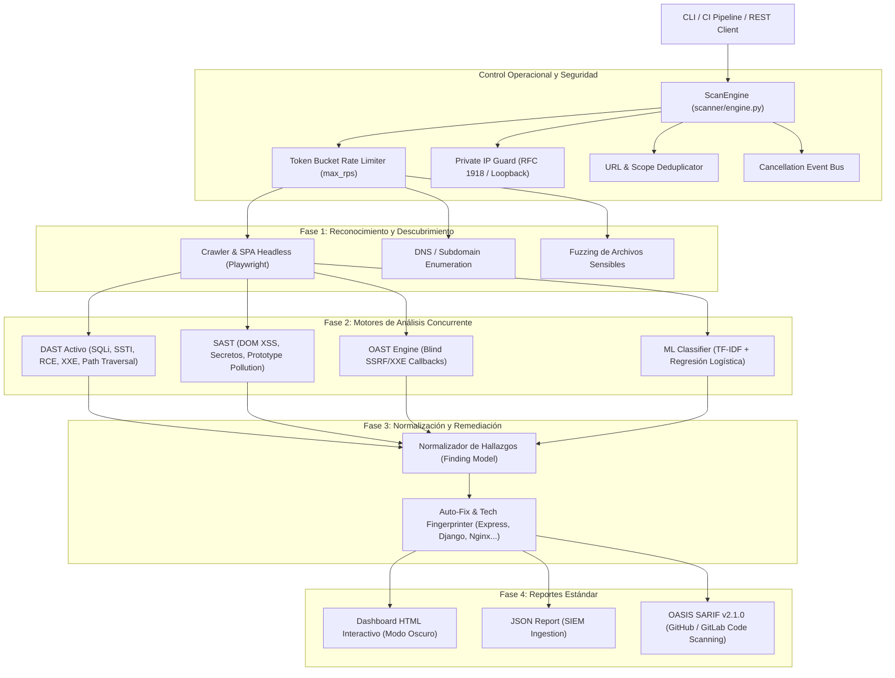

# Arquitectura y Diseño Técnico de VulnScanner

Este documento detalla la arquitectura interna, los flujos de ejecución, los mecanismos de seguridad operacional y las especificaciones de datos de **VulnScanner**.

---

## 1. Visión General del Sistema

VulnScanner es una plataforma de análisis de seguridad web modular orientada a DevSecOps. Combina cuatro metodologías de detección complementarias:

1. **DAST (Dynamic Application Security Testing):** Inyección controlada de vectores activos (SQLi, XXE, SSTI, Command Injection, Path Traversal, Open Redirect) con calibración basada en tiempo y firmas de error.
2. **SAST (Static Application Security Testing):** Análisis sintáctico y de flujo en scripts JavaScript embebidos y remotos para detección de DOM XSS, Prototype Pollution y fuga de secretos.
3. **SCA (Software Composition Analysis):** Inspección de dependencias frontend populares contra bases de datos de vulnerabilidades conocidas.
4. **OAST (Out-of-Band Application Security Testing):** Identificación de vulnerabilidades ciegas (Blind SSRF, Blind XXE, Blind RCE) mediante callbacks asíncronos correlacionados por tokens unívocos.



---

## 2. Motor Central y Seguridad Operacional (`scanner/engine.py`)

El componente `ScanEngine` actúa como orquestador centralizado de todos los módulos de escaneo. Implementa salvaguardas críticas para evitar degradación del objetivo o incidentes de denegación de servicio (DoS):

### Perfiles de Escaneo (`ScanProfile`)

| Perfil | Max RPS | Total Requests | Timeout | Payloads Activos | Profundidad Crawl | Workers | Retardo |
|---|:---:|:---:|:---:|:---:|:---:|:---:|:---:|
| **`passive`** | 2 | 200 | 15s | No (Solo análisis estático / cabeceras) | 1 | 3 | 1.0s |
| **`normal`** | 10 | 1,000 | 10s | Sí | 3 | 8 | 0.2s |
| **`aggressive`** | 50 | 5,000 | 8s | Sí | 5 | 20 | 0.05s |

### Mitigación de SSRF Operacional (`PRIVATE_RANGES`)
Para evitar que un escáner sea utilizado como pivote para atacar redes internas o interfaces de metadatos de nube (`169.254.169.254`), el motor valida la resolución DNS del host objetivo contra los bloques:
- `10.0.0.0/8`
- `172.16.0.0/12`
- `192.168.0.0/16`
- `127.0.0.0/8`
- `169.254.0.0/16`

A menos que se especifique `--allow-private`, cualquier intento de escanear estas direcciones es abortado de forma inmediata.

---

## 3. Modelo de Datos Estandarizado (`scanner/models.py`)

Cada hallazgo se transforma en una instancia inmutable del modelo `Finding`, el cual mapea automáticamente la taxonomía de seguridad:

- **CVSS v3.1:** Cálculo del puntaje base según vector formal (`CVSS:3.1/AV:N/AC:L/...`).
- **CWE (Common Weakness Enumeration):** Asociación taxonómica (ej. `CWE-89` para SQLi, `CWE-79` para XSS).
- **MITRE ATT&CK:** Mapeo de técnicas tácticas (ej. `T1190` - Exploit Public-Facing Application).
- **OWASP Top 10 2021:** Clasificación en las categorías A01 a A10.
- **Evidencia Técnica (`Evidence`):** Almacenamiento estructurado del método HTTP, URL de prueba, payload inyectado, código de respuesta HTTP y fragmento textual de confirmación.

---

## 4. Pipeline de Remediación y Auto-Fix (`scanner/autofix.py`)

VulnScanner no solo reporta la vulnerabilidad, sino que identifica el stack tecnológico mediante fingerprinting de cabeceras (`Server`, `X-Powered-By`) y patrones HTML/Cookies:
- **Node.js / Express**
- **Python / Django / FastAPI**
- **PHP / Laravel**
- **Nginx / Apache**
- **React / Next.js**

A partir de esta firma, genera snippets de código contextuales listos para aplicar (ej. configuración segura de cabeceras en `nginx.conf`, middleware `helmet` en Express o validación parametrizada con SQLAlchemy).

---

## 5. Especificación de API REST (`api.py`)

La API REST permite la automatización e integración con orquestadores CI/CD y plataformas SOAR:

- **Base de Datos:** SQLite con soporte `WAL` (Write-Ahead Logging) y control de concurrencia mediante `threading.Lock`.
- **Endpoints:**
  - `GET /` — Healthcheck y versión del servicio.
  - `POST /scan` — Encola una tarea asíncrona de escaneo (`BackgroundTasks`).
  - `GET /scan/{task_id}` — Consulta estado de la tarea y resultados detallados.
  - `GET /scans` — Historial paginado de escaneos ejecutados.
  - `GET /docs` — Swagger UI interactivo.
  - `GET /openapi.json` — Contrato OpenAPI 3.1 descargable ([docs/openapi.json](openapi.json)).

---

## 6. Despliegue en Entornos Empresariales (Docker y Kubernetes)

VulnScanner está preparado para ejecutarse como un worker efímero o como servicio continuo:

### Docker Compose
```bash
# Iniciar API REST
docker compose up -d api

# Ejecutar escaneo CLI bajo demanda
docker compose run --rm cli https://target.local --stealth --no-open
```

### Modelo Kubernetes CronJob (Auditorías Programadas)
Para escaneos periódicos en clústeres empresariales, se recomienda desplegar la imagen como un `CronJob` que ejecute el CLI con salida hacia un bucket S3 o volumen compartido montado en `/reports`.

---

## 7. Detección Inteligente de WAF y Circuit Breaker (`scanner/waf_detector.py`)

Para operar de forma fiable contra infraestructuras protegidas por WAFs comerciales (Cloudflare, AWS WAF, Akamai, Imperva, ModSecurity, F5), el motor implementa detección de firmas pasivas y activas:

- **Sondeo Perimetral:** Identifica cabeceras (`cf-ray`, `x-amzn-requestid`), cookies (`__cfduid`, `awselb`, `incap_ses`) y códigos de bloqueo.
- **Circuit Breaker:** Si el servidor objetivo o WAF devuelve códigos `429 Too Many Requests` o `503 Service Unavailable`, el motor transiciona de `CLOSED` a `OPEN`, aplicando un backoff exponencial y reduciendo dinámicamente la tasa de peticiones por segundo (`current_rps = max(1, current_rps * 0.5)`). Tras la ventana de enfriamiento, el circuito pasa a `HALF-OPEN` y se reanuda de manera cautelosa hasta volver a `CLOSED`.

---

## 8. Escaneo Guiado por Especificaciones API (`scanner/openapi_scanner.py`)

Permite auditar Microservicios y APIs REST sin depender de rastreadores HTML:
- **Soporte de Estándares:** OpenAPI 3.0 / 3.1 y Swagger 2.0 (remoto o archivo local).
- **Mapeo OWASP API Security Top 10:**
  - **API1:2023 BOLA / IDOR:** Pruebas automáticas de parámetros de ruta identificadores (`{id}`).
  - **API2:2023 Broken Authentication:** Detección de operaciones mutables (`POST`, `PUT`, `DELETE`) expuestas sin esquemas de seguridad.
  - **API8:2023 Security Misconfiguration:** Fuzzing con JSON malformado para detectar fugas de trazas internas o errores HTTP 500.
  - **Inyecciones en Parámetros:** Fuzzing controlado de parámetros query con firmas de bases de datos.

---

## 9. Motor Asíncrono de Ultra Alto Rendimiento (`scanner/async_engine.py`)

Para entornos donde el rendimiento y la velocidad de escaneo son prioritarios, el flag `--async-engine` activa el motor basado en `httpx.AsyncClient` y `asyncio`:
- **Conexiones Concurrentes No Bloqueantes:** Controladas mediante `asyncio.Semaphore` con pooling de conexiones HTTP/1.1 y HTTP/2.
- **Espaciamiento No Bloqueante:** Implementa rate limiting asíncrono y pausas de Circuit Breaker con `asyncio.sleep()`, multiplicando el rendimiento por 10x-20x frente a pools de hilos tradicionales.

