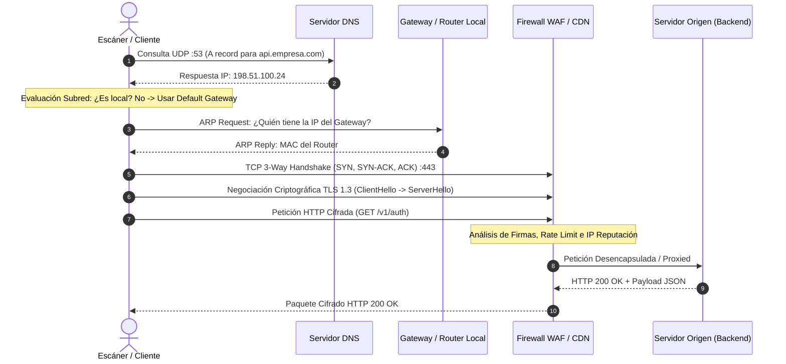

# Módulo 01: Fundamentos de Redes, Sockets, HTTP/TLS y Evasión Adaptativa de WAF

## 1. Introducción y Modelo Mental: La Vida de un Paquete

Para auditar aplicaciones web a nivel profesional, es fundamental eliminar la abstracción de que "el navegador simplemente pide una página". Toda comunicación web es una secuencia estricta de transformaciones de datos a través de capas lógicas y físicas.

Cuando un escáner de vulnerabilidades o un usuario ejecuta una petición HTTP:
```bash
curl -i https://api.empresa.com/v1/auth
```
Ocurre una cascada determinista de eventos:



---

## 2. El Modelo de Capas en la Práctica: De Capa 2 a Capa 7

A diferencia de las descripciones teóricas académicas de 7 capas, en la ingeniería de seguridad moderna operamos con el modelo TCP/IP práctico:

### 2.1 Capa 2 (Enlace de Datos) - Direcciones MAC
* **Función:** Conectar dos tarjetas de red físicas directamente adyacentes en el mismo medio físico (cable ethernet o radiofrecuencia WiFi).
* **Identificador:** Dirección MAC (48 bits, ej. `00:1A:2B:3C:4D:5E`).
* **Principio Crítico:** La dirección MAC de destino **cambia en cada salto (hop)**. Al enviar un paquete a Google, la MAC de destino es la de tu router local, no la de Google.

### 2.2 Capa 3 (Red) - Direcciones IP y Ruteo
* **Función:** Direccionamiento lógico global y determinación de la ruta entre hosts remotos a través de múltiples redes intermedias.
* **Identificador:** Dirección IP (IPv4: 32 bits, ej. `198.51.100.24`; IPv6: 128 bits).
* **Principio Crítico:** La dirección IP de destino permanece **inalterada de extremo a extremo** a lo largo de todo internet.
* **Subnetting y Máscara de Red:** Tu máquina aplica una operación lógica bit a bit (`AND`) entre la IP destino y tu máscara de subred (ej. `255.255.255.0` o `/24`). Si los bits de red coinciden, el paquete se entrega en la red local; si difieren, se encapsula con la MAC de la Puerta de Enlace (Default Gateway).

### 2.3 Capa 4 (Transporte) - TCP vs UDP y Sockets
* **Socket:** La combinación unívoca de `IP:Puerto` (ej. `192.168.1.50:52134` conectado a `198.51.100.24:443`).
* **TCP (Transmission Control Protocol):** Orientado a conexión, confiable, con control de congestión y reordenamiento de paquetes.
  - **3-Way Handshake:**
    1. **SYN (Synchronize):** El cliente envía un número de secuencia inicial aleatorio ($ISN_c$).
    2. **SYN-ACK:** El servidor responde con su propio $ISN_s$ y confirma recepción ($ACK = ISN_c + 1$).
    3. **ACK:** El cliente confirma ($ACK = ISN_s + 1$). La conexión queda establecida (`ESTABLISHED`).
* **UDP (User Datagram Protocol):** Sin conexión, no confiable, ultra-rápido, sin handshake ni retransmisiones. Utilizado en DNS, streaming y HTTP/3 (QUIC).

---

## 3. Seguridad en Tránsito: TLS 1.3 y la Criptografía de Sesión

Cualquier auditoría moderna ocurre sobre HTTPS. Comprender TLS 1.3 es vital para depurar problemas de conexión y certificados:

```
Cliente                                               Servidor
   |                                                     |
   | -------- ClientHello + Supported Groups ----------> |
   |          + Key Share (Clave pública efímera DH)     |
   |                                                     |
   | <------- ServerHello + Key Share ------------------ |
   |          + EncryptedExtensions + Certificate        |
   |          + CertificateVerify + Finished             |
   |                                                     |
   | [Ambos derivan la misma Clave Simétrica AES-GCM]    |
   |                                                     |
   | -------- Finished + [Datos HTTP Cifrados] --------> |
   |                                                     |
```

* **1-RTT Handshake:** TLS 1.3 redujo la negociación de 2 viajes de ida y vuelta (RTT) a 1 solo RTT.
* **Perfect Forward Secrecy (PFS):** Utiliza intercambio de claves Diffie-Hellman efímero (ECDHE). Incluso si un atacante roba la clave privada del servidor en el futuro, no podrá descifrar el tráfico capturado en el pasado.

---

## 4. El Problema en Auditorías: WAFs, Bloqueos y Rate-Limiting

Cuando un escáner de seguridad ejecuta cientos de peticiones por segundo, los Web Application Firewalls (Cloudflare, AWS WAF, Akamai, Imperva) detectan el patrón y responden con:
1. **HTTP 429 Too Many Requests:** Bloqueo temporal por tasa de peticiones.
2. **HTTP 403 Forbidden:** Bloqueo de IP por reputación o firma de User-Agent / Herramienta.
3. **CAPTCHA / Challenge:** Respuestas JavaScript interactivas que rompen clientes automatizados.

### 4.1 La Solución de Ingeniería: Algoritmo AIMD en OmniBreach

Para que una auditoría no sea bloqueada ni degrade el servicio en producción, el proyecto implementa un cliente adaptativo con el algoritmo **AIMD** (*Additive Increase, Multiplicative Decrease*), el mismo principio matemático que usa TCP para evitar colapsar la red.

Ubicación en el código: [`utils/adaptive_client.py`](file:///c:/Users/villa/VulnScanner/utils/adaptive_client.py)

```python
class AdaptiveRateLimiter:
    """
    Controlador de cadencia con algoritmo AIMD.
    - Incrementa peticiones/seg si el servidor responde 200 OK de forma sostenida.
    - Reduce agresivamente la tasa a la mitad ante HTTP 429 o firmas de WAF.
    """
    def __init__(self, initial_rate: float = 10.0, min_rate: float = 1.0, max_rate: float = 50.0):
        self.current_rate = initial_rate
        self.min_rate = min_rate
        self.max_rate = max_rate
        self.success_count = 0

    def on_success(self) -> None:
        self.success_count += 1
        # Additive Increase: cada 10 peticiones exitosas consecutivas, incrementamos +1 req/s
        if self.success_count >= 10:
            self.current_rate = min(self.max_rate, self.current_rate + 1.0)
            self.success_count = 0

    def on_rate_limit(self, retry_after: Optional[float] = None) -> float:
        self.success_count = 0
        # Multiplicative Decrease: recortar la velocidad a la mitad inmediatamente
        self.current_rate = max(self.min_rate, self.current_rate * 0.5)
        # Respetar la cabecera Retry-After del servidor si existe
        backoff_delay = retry_after if retry_after is not None else (1.0 / self.current_rate)
        return max(backoff_delay, 1.0)
```

### 4.2 Evasión Heurística de Cabeceras
Muchos WAFs y balanceadores de carga evalúan si la petición proviene de un proxy reverso o inspeccionan cabeceras de origen:
* Inyección controlada de cabeceras de reenvío: `X-Forwarded-For`, `X-Real-IP`, `X-Originating-IP`.
* Rotación de `User-Agent` de navegadores reales (Chrome, Firefox, Safari sobre Windows/macOS) en lugar de cadenas identificables como `python-requests/2.31`.

---

## 5. Preguntas Clave para Estudio y Guión de Video

1. **¿Por qué la dirección MAC cambia en cada salto mientras que la dirección IP se mantiene fija?**
   * *Respuesta:* Porque la MAC resuelve la entrega física dentro del enlace local (Capa 2), mientras que la IP resuelve el ruteo lógico global entre extremos (Capa 3).
2. **¿Qué diferencia fundamental hay entre un escaneo que usa sockets TCP directos y uno que pasa por un navegador headless?**
   * *Respuesta:* El socket HTTP envía texto plano y parsea respuestas sin ejecutar JavaScript. El navegador headless ejecuta el motor V8, resuelve código dinámico, interactúa con el DOM y descarga recursos vinculados.
3. **¿Cómo reacciona el algoritmo AIMD cuando el servidor devuelve un código `HTTP 429`?**
   * *Respuesta:* Aplica una disminución multiplicativa (reduce la tasa al 50%), resetea el contador de éxitos y aplica un retraso basado en la cabecera `Retry-After`.
