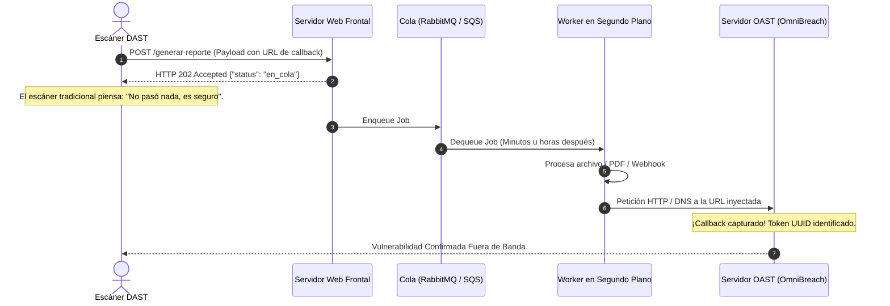

# Módulo 04: Auditoría Fuera de Banda (OAST) y Server-Side Request Forgery (SSRF)

## 1. El Gran Punto Ciego del DAST Tradicional: Vulnerabilidades Asíncronas

Los escáneres de seguridad de primera generación asumen una arquitectura sincrónica simple:
$$\text{Petición de Ataque} \longrightarrow \text{Servidor} \longrightarrow \text{Respuesta Inmediata}$$

Sin embargo, las arquitecturas empresariales modernas delegan el procesamiento a **sistemas asíncronos y colas de mensajería**:



Si el servidor responde inmediatamente con un `HTTP 202 Accepted` o `HTTP 200 OK`, un escáner convencional no ve ningún error ni reflejo en pantalla y cataloga el endpoint como falso negativo.

---

## 2. Metodología OAST (Out-of-Band Application Security Testing)

La técnica OAST consiste en desacoplar la prueba de la respuesta HTTP inmediata:
1. El escáner genera un identificador criptográfico único (Token de Correlación, ej. `uuid4()`).
2. Se inyecta una URL que apunta a un servidor listener controlado por el auditor:
   `http://oast-listener.local:8888/callback/7f9a1b2c-3d4e`
3. El escáner sondea periódicamente su propio servidor OAST:
   * Si el token fue consultado, se demuestra de forma irrefutable que el servidor víctima ejecutó la interacción.

### 2.1 La Implementación de OAST Local en OmniBreach

Para permitir auditorías en redes cerradas, laboratorios locales y entornos sin salida a internet público (air-gapped), el proyecto implementa un servidor OAST multihilo embebido en Python.

Ubicación en el código: [`scanner/oast.py`](file:///c:/Users/villa/VulnScanner/scanner/oast.py)

```python
class OASTLocalServer:
    """
    Servidor HTTP en segundo plano que escucha peticiones de interacción fuera de banda.
    Registra tokens de correlación y los asocia al módulo que originó la prueba.
    """
    def __init__(self, host: str = "127.0.0.1", port: int = 0):
        self.host = host
        self.port = port
        self.received_callbacks: dict[str, dict[str, Any]] = {}
        self.server: Optional[HTTPServer] = None
        self.thread: Optional[threading.Thread] = None

    def start(self) -> None:
        self.server = HTTPServer((self.host, self.port), self._create_handler())
        self.port = self.server.server_port  # Puerto dinámico asignado por el SO
        self.thread = threading.Thread(target=self.server.serve_forever, daemon=True)
        self.thread.start()

    def generate_token(self, context: str) -> str:
        token = str(uuid.uuid4())
        self.tokens[token] = {"context": context, "timestamp": time.time()}
        return token

    def verify_callback(self, token: str) -> bool:
        return token in self.received_callbacks
```

### 2.2 OAST vía DNS vs. OAST vía HTTP
En entornos corporativos reales con firewalls estrictos (egress filtering):
* **HTTP saliente (puertos 80/443):** Generalmente bloqueado hacia IPs desconocidas.
* **DNS saliente (puerto 53 UDP):** Casi **siempre permitido** porque los servidores internos necesitan resolver nombres mediante el servidor DNS corporativo, el cual recursivamente consulta a internet.
* Por esta razón, herramientas como Burp Collaborator o `interact.sh` operan como servidores DNS autoritativos públicos.

---

## 3. Server-Side Request Forgery (SSRF)

El SSRF ocurre cuando una aplicación web permite a un usuario suministrar una URL arbitraria que el servidor backend descarga o procesa directamente (por ejemplo: vista previa de imágenes, importación de feeds RSS, webhooks o convertidores de HTML a PDF).

```
Atacante ----> [Servidor Web Público] ----> [Servicios Internos No Expuestos]
                 (Firewall Exterior)            • 127.0.0.1:6379 (Redis)
                                                • 10.0.0.5:9200 (Elasticsearch)
                                                • 169.254.169.254 (Metadatos AWS)
```

### 3.1 Los Dos Vectores Críticos de Explotación de SSRF

#### Vector 1: Extracción de Credenciales en Nubes Públicas (AWS / GCP / Azure)
En AWS, las instancias EC2 se comunican con el servicio de metadatos de enlace local (**IMDSv1**) en la IP reservada `169.254.169.254`. Si una aplicación tiene SSRF:

```http
GET /api/descargar-imagen?url=http://169.254.169.254/latest/meta-data/iam/security-credentials/rol-servidor HTTP/1.1
```

El servidor web consulta esa IP interna y devuelve las credenciales temporales de AWS (`AccessKeyId`, `SecretAccessKey`, `Token`), permitiendo al atacante tomar el control de la infraestructura en la nube.

#### Vector 2: Blind SSRF Confirmado vía OAST
Cuando el servidor descarga la URL pero no devuelve el cuerpo en la respuesta (por ejemplo, al verificar la existencia de un webhook):
* El escáner inyecta la URL del servidor OAST: `http://servidor-oast/webhook-test`.
* Si el servidor OAST registra la petición HTTP entrante, se comprueba la existencia de SSRF Ciego sin necesidad de ver los datos descargados.

---

## 4. Preguntas Clave para Estudio y Guión de Video

1. **¿Por qué un ataque de Blind XXE o Blind SSRF es completamente invisible para un escáner que solo analiza las respuestas HTTP directas?**
   * *Respuesta:* Porque la vulnerabilidad se ejecuta en un hilo o worker en segundo plano que no tiene conexión directa con el socket de la petición HTTP inicial, devolviendo al cliente una respuesta genérica de éxito o aceptación de tarea.
2. **¿Por qué el protocolo DNS es el canal de exfiltración y callback OAST más confiable en entornos protegidos por firewalls?**
   * *Respuesta:* Porque la mayoría de las redes corporativas bloquean el tráfico HTTP saliente hacia destinos no autorizados, pero permiten consultas DNS recursivas al puerto 53 para que la infraestructura funcione.
3. **¿Cómo mitiga AWS IMDSv2 el robo de credenciales por SSRF frente a IMDSv1?**
   * *Respuesta:* IMDSv2 requiere una petición previa `PUT` para obtener un token de sesión de corta duración con una cabecera personalizada (`X-aws-ec2-metadata-token`), lo que neutraliza los ataques de SSRF simples que solo permiten peticiones `GET`.
