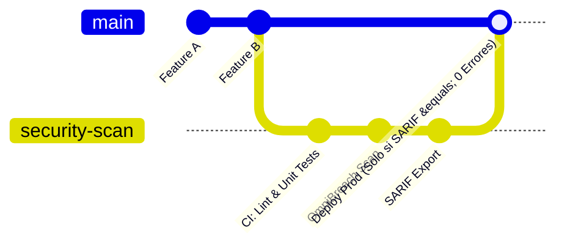

# Módulo 07: Cumplimiento Normativo Corporativo, SARIF y DevSecOps

## 1. El Puente entre la Ingeniería de Seguridad y el Negocio

En el mundo corporativo, a un CISO (Chief Information Security Officer), a un auditor bancario o a una junta directiva no se les presentan volcados de terminal con logs de errores. Las organizaciones invierten en ciberseguridad impulsadas principalmente por tres factores:
1. **Riesgo Operativo y Pérdida de Datos:** Evitar multas millonarias e interrupción de servicios.
2. **Cumplimiento Regulatorio Obligatorio:** Leyes y estándares bancarios sin los cuales no pueden operar legalmente.
3. **Automatización en CI/CD (DevSecOps):** Detectar vulnerabilidades en el código antes de que llegue a producción, ahorrando costos de remediación tardía.

---

## 2. Los Cuatro Grandes Marcos de Cumplimiento Implementados

OmniBreach cuenta con un motor de cumplimiento formal ([`utils/compliance.py`](file:///c:/Users/villa/VulnScanner/utils/compliance.py)) que clasifica automáticamente cada vulnerabilidad técnica dentro de los marcos regulatorios internacionales:

```
                            [ Hallazgo Técnico (Finding) ]
                                          |
        +------------------+--------------+------------------+
        |                  |                                 |
        v                  v                                 v
   [ PCI-DSS v4.0 ]   [ OWASP Top 10 (2021) ]         [ ISO/IEC 27001:2022 ]
   • Req 6.2.4        • A01: Broken Access            • A.8.8 (Vuln Mgmt)
   • Req 6.4.1        • A03: Injection                • A.8.20 (Network Sec)
   • Req 8.3.1        • A05: Security Misconfig       • A.8.24 (Crypto)
   • Req 4.1.2        • A10: SSRF                     • A.8.26 (Secure Dev)
```

---

### 2.1 PCI-DSS v4.0 (Estándar de Seguridad de Datos para la Industria de Tarjetas de Pago)
Obligatorio para cualquier empresa que procese, almacene o transmita números de tarjetas de crédito:
* **Requisito 6.2.4:** Protección contra vulnerabilidades de software conocidas (Inyecciones SQL, XSS, desbordamientos de memoria).
* **Requisito 6.4.1 y 6.4.3:** Gestión e integridad de scripts del lado del cliente (evitar ataques tipo *Magecart* donde scripts de terceros roban datos de tarjetas en el formulario de pago).
* **Requisito 4.1.2:** Uso de criptografía fuerte en tránsito (HSTS obligatorio, prohibición de TLS 1.0/1.1 y suites de cifrado débiles).
* **Requisito 8.3.1:** Autenticación robusta y protección de tokens de sesión (flags `HttpOnly` y `Secure`).

### 2.2 OWASP Top 10 (2021)
El estándar global de referencia para riesgos en aplicaciones web:
* `A01:2021` - Broken Access Control (CORS inseguro, redirecciones abiertas).
* `A02:2021` - Cryptographic Failures (Falta de HSTS, cookies transmitidas por HTTP).
* `A03:2021` - Injection (SQLi, XXE, Command Injection).
* `A05:2021` - Security Misconfiguration (Cabeceras faltantes, métodos HTTP peligrosos).
* `A10:2021` - Server-Side Request Forgery (SSRF).

---

## 3. El Estándar SARIF v2.1.0 y la Integración en GitHub

Históricamente, cada herramienta de seguridad generaba su propio formato JSON propietario, lo que dificultaba consolidar datos en plataformas empresariales.

**SARIF (Static Analysis Results Interchange Format - OASIS Standard)** es el formato estándar internacional para intercambiar resultados de análisis de seguridad entre escáneres y plataformas de desarrollo.

Ubicación en el código: [`utils/sarif.py`](file:///c:/Users/villa/VulnScanner/utils/sarif.py)

```json
{
  "$schema": "https://json.schemastore.org/sarif-2.1.0.json",
  "version": "2.1.0",
  "runs": [
    {
      "tool": {
        "driver": {
          "name": "OmniBreach",
          "version": "4.1.0",
          "rules": [
            {
              "id": "OMNI-SQLI-001",
              "name": "SQLInjection",
              "shortDescription": {"text": "Inyección SQL Confirmada"},
              "relationships": [
                {
                  "target": {
                    "id": "PCI-DSS-6.2.4",
                    "index": 0,
                    "toolComponent": {"name": "PCI-DSS"}
                  }
                }
              ]
            }
          ]
        }
      },
      "results": [
        {
          "ruleId": "OMNI-SQLI-001",
          "level": "error",
          "message": {"text": "Inyección SQL booleana confirmada en parámetro 'id'."}
        }
      ]
    }
  ]
}
```

### 3.1 Beneficios de SARIF en GitHub Advanced Security
Cuando OmniBreach corre en un pipeline de GitHub Actions y emite un archivo SARIF:
1. GitHub lee el archivo automáticamente mediante la acción `github/codeql-action/upload-sarif`.
2. Las vulnerabilidades aparecen en la pestaña oficial **Security > Code scanning alerts** del repositorio.
3. Se añaden anotaciones visuales directamente en el Pull Request del desarrollador, bloqueando la fusión (*Merge*) si se detectan fallos críticos.

---

## 4. Flujo DevSecOps: Seguridad Automatizada como Código

El enfoque moderno "Shift-Left" traslada la seguridad desde auditorías manuales esporádicas hacia la verificación continua y automatizada en cada `git push`:



1. **Desarrollo:** El programador sube una nueva funcionalidad a una rama.
2. **Pipeline de Integración:** El runner de CI/CD levanta la aplicación en un contenedor de pruebas.
3. **Escaneo Automático:** OmniBreach ejecuta un perfil rápido/balanceado contra la aplicación levantada.
4. **Veredicto Automático:**
   * Si existen vulnerabilidades con severidad `Crítico` o `Alto` y `confidence="confirmed"`, el pipeline falla automáticamente.
   * El código defectuoso nunca llega a los servidores de producción.

---

## 5. Preguntas Clave para Estudio y Guión de Video

1. **¿Por qué los formatos de reporte propietarios (JSON simple o PDFs estáticos) están siendo reemplazados por SARIF en la industria?**
   * *Respuesta:* Porque SARIF es un estándar abierto interoperable soportado de forma nativa por plataformas de CI/CD (GitHub, GitLab, Azure DevOps, Jira), permitiendo visualizar y gestionar hallazgos directamente en el flujo de trabajo de los desarrolladores sin importar qué escáner los produjo.
2. **¿Cuál es el requisito de PCI-DSS v4.0 que exige supervisar la integridad de los scripts que se ejecutan en el navegador web?**
   * *Respuesta:* El Requisito 6.4.3, introducido en la versión 4.0 para mitigar ataques de skimming en formularios de pago (*Magecart*), exigiendo que cada script cuente con justificación de negocio y verificación de integridad.
3. **¿Qué ventaja económica tiene el enfoque "Shift-Left" en DevSecOps frente a la auditoría tradicional de caja negra al final del proyecto?**
   * *Respuesta:* Corregir una vulnerabilidad durante la etapa de desarrollo en CI/CD es hasta 30 a 60 veces más económico y rápido que solucionarla cuando la aplicación ya está desplegada en producción y comprometida por un atacante.
