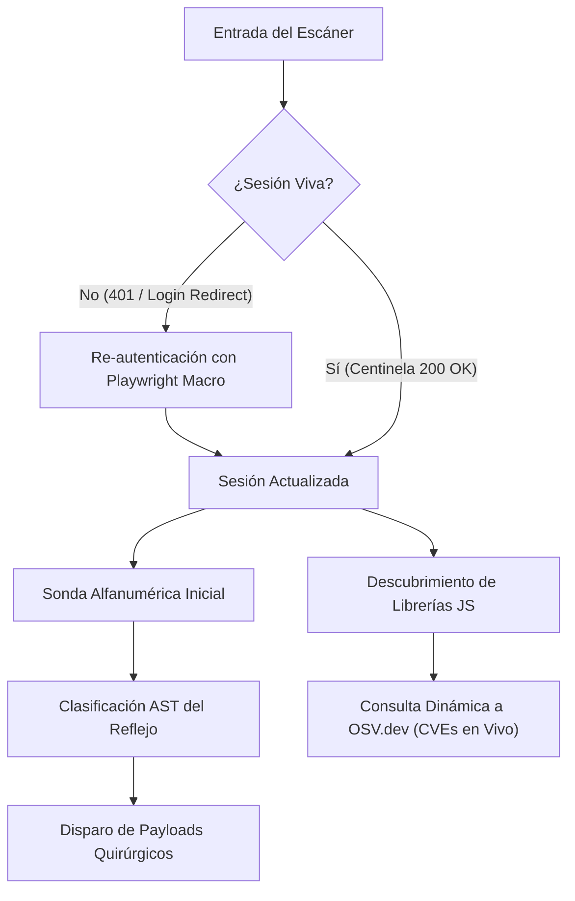

# Módulo 08: Arquitectura Avanzada v5.0.0 — SCA en Tiempo Real, Macros de Sesión, Fuzzing Contextual y Harness de Benchmarks

## 1. El Salto a v5.0.0: De Escáner Heurístico a Plataforma Adaptativa

La versión 5.0.0 de OmniBreach introduce cuatro saltos de ingeniería que transforman la forma en que el motor interactúa con aplicaciones web modernas:
1. **Inteligencia en Vivo (SCA Dinámico):** Reemplazo de diccionarios locales rígidos por consultas asíncronas a bases de datos de vulnerabilidades globales (OSV.dev).
2. **Conciencia de Estado (State-Aware Sessions):** Capacidad de auditar aplicaciones de página única (SPAs) y SaaS protegidos por autenticación compleja sin perder la sesión.
3. **Fuzzing Quirúrgico (Context-Aware AST):** Detección matemática de la posición de la entrada en el DOM antes de disparar payloads.
4. **Validación Científica Continua (Benchmark Harness):** Medición de precisión y detección de regresiones automatizada en CI/CD.



---

## 2. SCA Dinámico con OSV.dev (Open Source Vulnerabilities API)

### 2.1 La Limitación Histórica
Los escáneres DAST y SCA tradicionales incluyen listas estáticas de dependencias desactualizadas en su propio código (`bootstrap <= 3.3.7`). Si un nuevo exploit (0-day o 1-day) se publica hoy en la base de datos nacional de vulnerabilidades (NVD), el escáner permanece ciego hasta que un desarrollador actualice manualmente sus diccionarios.

### 2.2 La Solución en OmniBreach ([`scanner/sca.py`](file:///c:/Users/villa/VulnScanner/scanner/sca.py))
El motor integra un cliente directo contra la API de **OSV.dev** (proyecto respaldado por Google y la Open Source Security Foundation - OpenSSF):

* **Formato de Consulta:**
  ```http
  POST https://api.osv.dev/v1/query HTTP/1.1
  Content-Type: application/json

  {
    "package": {
      "name": "lodash",
      "ecosystem": "npm"
    },
    "version": "4.17.15"
  }
  ```
* **Mapeo Automatizado de CVSS:**
  OSV devuelve la estructura completa de advertencias (GHSAs y CVEs). OmniBreach normaliza la severidad:
  - `CRITICAL` $\rightarrow$ Riesgo **Crítico**.
  - `HIGH` $\rightarrow$ Riesgo **Alto**.
  - `MODERATE` / `MEDIUM` $\rightarrow$ Riesgo **Medio**.
  - `LOW` $\rightarrow$ Riesgo **Bajo**.
* **Caché y Respaldo Hermético:**
  Se mantiene un diccionario en memoria (`_OSV_CACHE`) para no reiterar consultas sobre la misma librería, y un mecanismo de **fallback transparente**: si la red no responde o la auditoría se ejecuta en un centro de datos aislado (air-gapped), recurre automáticamente a la base local `VULNERABLE_LIBS`.

---

## 3. Motor de Sesiones de Negocio y Re-autenticación en Caliente (State-Aware)

### 3.1 El Problema de la Expiración de Sesión en DAST
En una auditoría profunda que prueba 500 parámetros, el escáner puede tardar 20 minutos. Si la aplicación objetivo implementa tokens JWT con expiración de 10 minutos o cookies que se anulan al detectar actividad anormal:
* A los 10 minutos, la sesión muere.
* Las siguientes 400 peticiones del escáner reciben un código `302 Found` redirigiendo a `/login`.
* El escáner reporta falsamente que la aplicación es 100% segura porque ninguna inyección tuvo efecto en la pantalla de inicio de sesión.

### 3.2 La Arquitectura de Macros ([`scanner/session_macro.py`](file:///c:/Users/villa/VulnScanner/scanner/session_macro.py))
OmniBreach implementa el patrón **State-Aware Session Manager**:

```json
{
  "name": "corporate_sso_login",
  "sentinel_url": "https://portal.empresa.com/api/v1/users/me",
  "sentinel_expected_status": 200,
  "login_redirect_patterns": ["/login", "/auth/sso", "/signin"],
  "steps": [
    {"action": "goto", "url": "https://portal.empresa.com/login"},
    {"action": "fill", "selector": "#username", "value": "auditor_sec"},
    {"action": "fill", "selector": "#password", "value": "TokenTemporal123!"},
    {"action": "click", "selector": "#btn-submit"},
    {"action": "wait_ms", "value": "1500"}
  ]
}
```

1. **Monitoreo Continuo (Centinela):** Antes de cada lote de ataques, el motor consulta `sentinel_url`. Si recibe un `401 Unauthorized` o una redirección a `/login`, congela el escaneo.
2. **Replay Transparente:** Dispara en segundo plano el macro mediante **Playwright** (interactuando con los campos del formulario como un humano) o peticiones HTTP.
3. **Persistencia Dinámica:** Extrae las nuevas cookies y cabeceras `Authorization: Bearer ...` hacia el pool de conexiones de `requests.Session` y reanuda el escaneo exactamente donde quedó.

---

## 4. Fuzzing Contextual con AST (Context-Aware Injection)

### 4.1 Por qué las Listas Estáticas de Payloads son Ineficientes
Probar 100 payloads ciegos (`<script>alert(1)</script>`, `">`, `javascript:alert(1)`) por cada parámetro de consulta:
1. Multiplica por 100 el tráfico de red.
2. Dispara sistemas de detección de intrusos (IDS/WAF).
3. La mayoría de los payloads son sintácticamente imposibles en el punto donde cae la entrada.

### 4.2 Detección de Reflejo en OmniBreach ([`scanner/context_fuzzer.py`](file:///c:/Users/villa/VulnScanner/scanner/context_fuzzer.py))
El escáner envía primero una **sonda benigna alfanumérica única** (ej. `vScanProbe74`) que no activa alarmas de WAFs. Al recibir la respuesta, analiza la estructura sintáctica del DOM alrededor de la sonda:

| Contexto Detectado | Estructura en el HTML | Payload Quirúrgico Generado |
| :--- | :--- | :--- |
| **`HTML_BODY`** | `<div>Búsqueda: vScanProbe74</div>` | `<script>alert(1)</script>`, `<svg onload=alert(1)>` |
| **`ATTR_VALUE`** | `<input value="vScanProbe74">` | `" onfocus="alert(1)" autofocus="`, `"><script>alert(1)</script>` |
| **`URI_ATTR`** | `<a href="vScanProbe74">Perfil</a>` | `javascript:alert(1)` |
| **`SCRIPT_BLOCK`** | `<script>var q = 'vScanProbe74';</script>` | `';alert(1)//`, `</script><script>alert(1)</script>` |
| **`HTML_COMMENT`** | `<!-- Consulta: vScanProbe74 -->` | `--> <script>alert(1)</script>` |

* **Resultado:** Si el parámetro se refleja en un bloque `<script>`, el motor **no gasta tiempo probando etiquetas `<input>` ni comodines HTML**; dispara directamente secuencias de escape de cadenas JavaScript (`';alert(1)//`).

---

## 5. Harness de Benchmark Automatizado y Detección de Regresión

### 5.1 El Principio de la Validación Empírica
Una herramienta de seguridad no puede evaluarse por la cantidad de líneas de código que tiene, sino por su rendimiento frente a un **Ground Truth** (una aplicación vulnerable documentada donde se conocen exactamente todos los fallos existentes).

### 5.2 El Guardián de Calidad ([`scripts/run_benchmarks.py`](file:///c:/Users/villa/VulnScanner/scripts/run_benchmarks.py))
El script `run_benchmarks.py` automatiza la auditoría contra **OWASP Juice Shop** y **PyGoat**:
* Calcula la matriz de confusión:
  $$\text{Precision} = \frac{TP}{TP + FP} \quad , \quad \text{Recall} = \frac{TP}{TP + FN} \quad , \quad F_1 = 2 \cdot \frac{\text{Precision} \cdot \text{Recall}}{\text{Precision} + \text{Recall}}$$
* Almacena el historial en `reports/benchmark_history.json`.
* **Regla de Regresión:** Si un desarrollador introduce un cambio que reduce la precisión respecto al escaneo anterior o aumenta la cantidad de falsos positivos ($FP_{\text{nuevo}} > FP_{\text{anterior}}$), el proceso aborta con código de error `sys.exit(1)`.
* **Integración CI/CD:** El workflow [`.github/workflows/security_benchmark.yml`](file:///c:/Users/villa/VulnScanner/.github/workflows/security_benchmark.yml) despliega Juice Shop en contenedores Docker y ejecuta esta validación en cada Pull Request.

---

## 6. Preguntas Clave para Estudio y Guión de Video

1. **¿Qué ventaja operativa ofrece consultar la API de OSV.dev en tiempo real en lugar de mantener un archivo estático de versiones vulnerables?**
   * *Respuesta:* Permite detectar vulnerabilidades y CVEs divulgados hace horas o días sin requerir que los usuarios actualicen o recompilen el código del escáner, garantizando cobertura contra 1-days recientes.
2. **¿Por qué una prueba de XSS basada en análisis contextual de reflejo genera mucho menos ruido en los logs del servidor auditado?**
   * *Respuesta:* Porque en lugar de enviar decenas de payloads genéricos a ciegas, primero comprueba si la entrada se refleja usando una sonda benigna inofensiva y luego envía únicamente los 2 o 3 payloads capaces de romper la sintaxis específica del punto de inyección.
3. **¿Cómo previene el arnés de benchmark (`BenchmarkHarness`) que una mejora diseñada para detectar un nuevo tipo de vulnerabilidad arruine la precisión general del escáner?**
   * *Respuesta:* Compara automáticamente la matriz de confusión contra el registro histórico anterior; si la nueva regla produce un solo falso positivo adicional contra el entorno estándar de prueba, marca una regresión y bloquea el despliegue.
